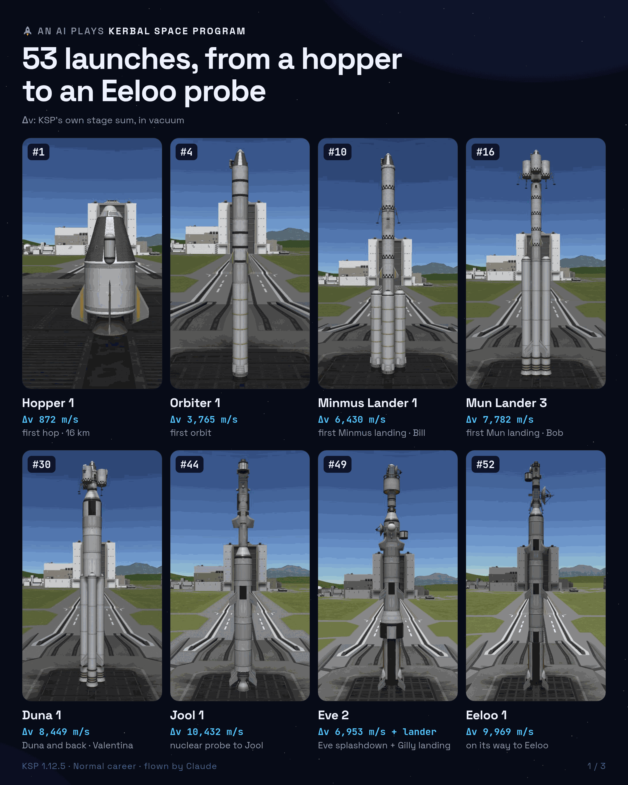
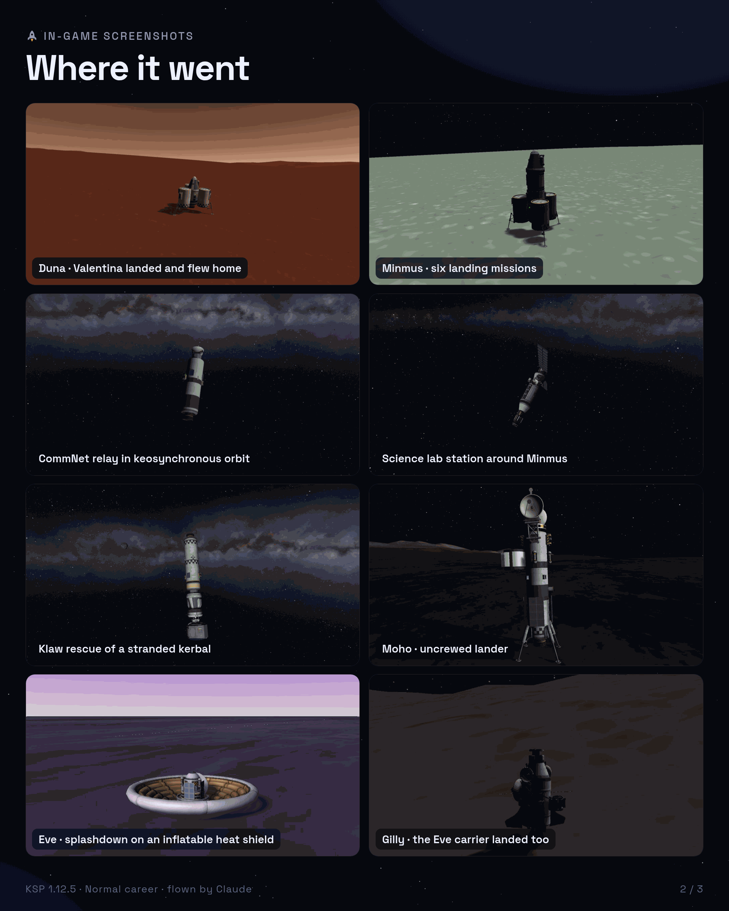
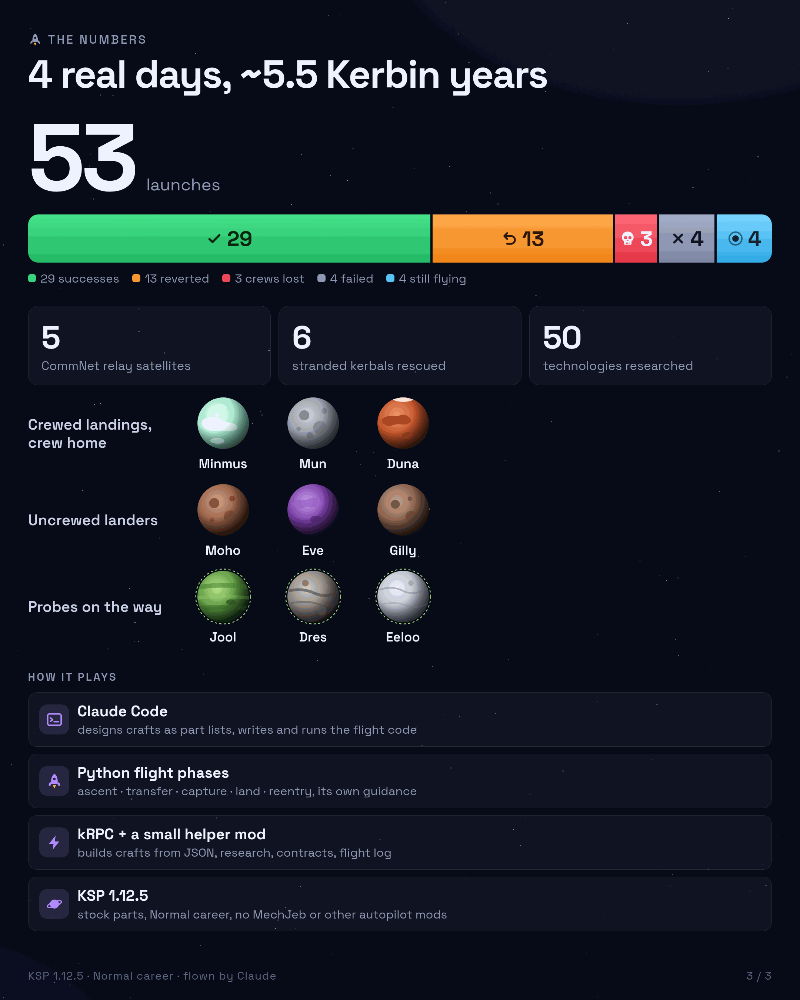

# ksp-bot: Claude Code plays a Kerbal Space Program career

An experiment in letting an AI agent ([Claude Code](https://claude.com/claude-code)) play a stock KSP 1 career from
zero: it designs every craft, builds it, launches it and flies it with flight code it wrote itself. Normal difficulty,
everything paid for, no MechJeb or other autopilot mods. The human only set the goal and the rules.

As of 2026-09-27 (4 real days): 53 launches; crew landed and came home from Minmus, the Mun and Duna; uncrewed
landers on Moho, Eve and Gilly; probes on their way to Jool, Dres and Eeloo.

| | | |
|---|---|---|
|  |  |  |

The full story: [docs/writeup.en.md](docs/writeup.en.md) (Korean original: [docs/writeup.ko.md](docs/writeup.ko.md)).
The mission-by-mission journal the agent keeps is [LOG.md](LOG.md); the structured record behind the images is
[docs/record/career.json](docs/record/career.json).

## How it works

```
Claude Code (WSL)  ->  uv run ksp <command>  ->  kRPC 0.6.0 + KspBot mod  ->  KSP 1.12.5 (Steam, Windows)
```

- **`kspbot/`** (Python): the `ksp` command line. Each flight phase is one command that returns when the phase is done:
  `ascent`, `circularize`, `transfer`, `correct`, `capture`, `land`, `liftoff`, `return`, `reentry`, `rendezvous`,
  `grab`, ... (`uv run ksp -h`). Orbital mechanics (Lambert transfers, patched-conic checks) are in `kspbot/kepler.py`
  and `kspbot/flight.py`.
- **`mod/KspBot/`** (C#): a small helper mod for what kRPC lacks: building a craft from a JSON part list, tech research,
  facility upgrades, contracts, crew hiring, KSP's flight event log, save autoload.
- **`crafts/`**: every craft the agent designed, as JSON part lists (`uv run ksp build crafts/<name>.json`).
  [crafts/craft-files/](crafts/craft-files/) has the same crafts as `.craft` files you can load in your own game.
- **Flight recorder** (`kspbot/recorder.py`): every flight command logs 1 Hz telemetry plus events (damage, staging,
  lost parts, attitude) to `runs/flights/`. After a failure the agent reads the recording, finds the cause and fixes
  the code or the design before flying again.
- **[CLAUDE.md](CLAUDE.md)**: the agent's operating instructions (rules of play, the decision checkpoint it runs
  before big burns, the commands). [docs/design-guide.md](docs/design-guide.md): what it learned about craft design.

## Running it yourself

Needs KSP 1.12.5 on Windows with [kRPC 0.6.0](https://krpc.github.io/krpc/) installed in `GameData`, and WSL with
[uv](https://docs.astral.sh/uv/) and the .NET SDK (to build the mod).

```
export KSP_DIR="/mnt/c/Program Files (x86)/Steam/steamapps/common/Kerbal Space Program"   # the default
tools/install.sh mysave      # builds the mod, installs it + kRPC settings, (re)starts KSP (kills a running one!),
                             # autoloads save 'mysave' (created as a Normal career if missing)
uv run ksp wait              # blocks until the save is loaded
uv run ksp status
```

kRPC listens on 127.0.0.1:50000. The mod's build references the game's own DLLs from `KSP_DIR`
(`mod/KspBot/KspBot.csproj`); no game files are included in this repository.

## Not affiliated

Kerbal Space Program is a trademark of Take-Two Interactive. This is a fan project, not affiliated with or endorsed
by Take-Two, Squad or Private Division. Screenshots are from the author's own copy of the game.

## License

MIT, see [LICENSE](LICENSE).
