# Claude Code plays a KSP career by itself (notes for a writeup)

Korean original: [writeup.ko.md](writeup.ko.md)

This document collects material for a blog post. The detailed per-mission journal is in `LOG.md`, the design lessons
are in `docs/design-guide.md` §0, and raw material pulled from earlier session transcripts (the user's messages verbatim,
a minute-by-minute timeline of the start, statistics) is in `docs/transcript-notes.md`. Flight telemetry is in
`runs/flights/*.jsonl` (not in git), screenshots are in `docs/media/`. Update this file whenever a new milestone is reached.

## 1. One-line summary
Claude Code plays a **Normal-difficulty career** of Kerbal Space Program 1 (1.12.5, Steam, Windows) by itself from a
WSL terminal. Rocket design, building, launching, flying, research, facility upgrades, accepting contracts: Claude does all of it.
The only goal the human gave was "start from scratch, get to Minmus, then Mun, then Duna, going farther step by step."
No autopilot mods (MechJeb etc.) are used, and Claude wrote the flight control code itself.

What got done on day one (2026-09-24, started 08:14 KST) in about 7 hours:
- About 2 hours building the tooling: the mod, the flight code, and an uncrewed Minmus round trip flown end to end in sandbox to verify it
- Career: first launch → orbit → Minmus flyby → **crewed Minmus landing and return** → **crewed Mun landing and return**
- Funds 25k → about 420k, reputation 105
- Three sessions played in sequence via handoffs (build session → flight session → current session). All were Claude Opus;
  the two sessions combined made 437 tool calls, 184+ `uv run ksp` commands, and 17 screenshot checks.

The starting prompt (user's words):
> I've finished downloading KSP (Kerbal Space Program 1) on Steam. Make it so that, through a Claude Code session like this one (or another LLM session), you can control KSP and play career mode from zero, building, launching and flying spacecraft. Set up a system that lets you reach Minmus and then go farther step by step. (...) And don't make the system too complicated, only exactly as much as needed, this is very important, otherwise it ends with just building the system. I think you'll need to make a separate mod so it's easy for an LLM to control.


*Mun Lander 3 on the Mun Midlands (Bob Kerman). The landing was controlled by `land()`, written by Claude.*

## 2. Architecture: how Claude controls KSP

```
Claude Code (WSL terminal)
   │  uv run ksp <command>   ← one command = one flight phase (ascent, transfer, land ...)
   ▼
kspbot/ (Python)            core.py connection · flight.py flight phases · recorder.py flight recorder · cli.py
   │  kRPC (TCP 127.0.0.1:50000)
   ▼
KSP 1.12.5 (Windows)
   ├─ kRPC 0.6.0 mod        : read vessel state, throttle/attitude/staging, maneuver nodes, time warp
   └─ KspBot mod (our own, C# ~870 lines): what kRPC lacks
        · CraftBuilder : JSON spec → .craft file (VAB building as code)
        · Service      : tech research, facility upgrades, crew hiring, part list, KSP flight event log,
                         closing popups, status queries, (sandbox only) orbit teleport
        · AutoLoad     : autoloads the save from the main menu (game starts without clicks)
```

- **No looking at the screen and clicking.** Everything goes through the API. The screen is only for checking
  (`ksp shot` → game screenshot PNG → Claude reads it as an image).
- **Flying is done as phase commands.** `ascent --alt 80000` → `circularize` → `transfer Minmus --pe 20000` →
  `soi` → `capture` → `land` → `science` → `liftoff` → `return` → `reentry`. Each command returns only when its phase
  is done. Long phases (transfer, reentry) run in the background, and when the completion notice arrives, the next phase starts.
- **Flight recorder**: every flight command writes 1 Hz telemetry and events to JSONL. Damage, explosions and overheating
  (from KSP's flight log), parts that disappeared, staging, and attitude problems (tumbling, AoA oscillation, spin) are printed
  live as one line each, `!! [kind] ...`. After a failure, this record is read first and the cause diagnosed before any code or
  design is changed (a principle the user asked for: "observe and record before you fix").
- **The flight algorithms are our own.**
  - Ascent: gravity turn starting the pitch-over at 250 m, AoA limit, throttle based on predicted time to apoapsis
  - Transfer: Hohmann phase-angle calculation → maneuver node → node components tuned by coordinate descent to hit the target periapsis
  - Landing: deceleration curve based on leg height + feed-forward, deceleration cap 3 m/s² (touchdown ~1.5 m/s in simulation)
  - Orbital survey: precompute the ground track, warp to the time it passes over the contract site, then run the experiment
- **Session handoff**: when the context gets long, Claude sessions pass a handoff message and continue playing
  (CLAUDE.md + LOG.md + memory are the handoff material).

## 2.5 Getting started: from an empty folder to the first flight (about 2 hours)
`docs/transcript-notes.md` §2 has the minute-by-minute timeline. Summary:
1. Found the Steam install path and settled three opening questions (Normal difficulty, kRPC + a homemade helper mod, revert policy).
2. Downloaded and installed kRPC 0.6.0 from GitHub. The kRPC server didn't start automatically, so to turn it on without clicks,
   Claude dug through DLL strings and the kRPC source and found the `autoStartServers` setting key.
3. **Decompiled KSP** (ilspycmd, with a `DOTNET_ROLL_FORWARD=Major` workaround for a .NET version mismatch). From that it read
   the .craft file format, the research and facility APIs, and even the editor's surface-attach rotation rules. Going from writing
   the mod to a successful build took about 12 minutes.
4. Inside KSP, Unity's `JsonUtility` couldn't parse the craft spec JSON, so a small JSON parser was added by hand.
5. The first connection worked and a career was created automatically (funds 25,000). Building a test craft from JSON, launching
   it and recovering it under a parachute worked within 20 minutes.
6. Wrote the whole flight code (ascent to reentry). Then, before touching the career, **flew one uncrewed Minmus round trip end to
   end in sandbox to verify it** (about 41 minutes). During that, circularization overshot and the rocket started falling back,
   and a manual burn saved it. Four radial boosters also separated near max Q and wrecked the core engine; that is where the
   later rule "attach boosters directly to the core, no radial decouplers" comes from.
7. Research was first handed to deepseek (codex), which failed on its usage limit; a sonnet subagent did the web research and
   wrote the design guide. Meanwhile the main session wrote CLAUDE.md with the goal "any LLM session can read just this and
   continue playing."
8. Screen capture was first done with Windows PowerShell, grabbing the whole desktop. Later it switched to kRPC's game screen capture.

## 3. Rules (agreed with the user)
- Normal-difficulty career. Launch costs, research and upgrades are all paid for the normal way.
- No autopilot mods. The flight logic is written by us.
- **Revert**: at first it was "forbidden by default, but allowed during testing (i.e. while building the system, not when testing
  a launch attempt itself) when something fails because of a bug," and later it became "a revert the game offers is fine" (revert
  to launch or to the VAB). If the revert window has passed, the loss stands. Quickload is only for when our tooling caused the
  failure. Every revert is logged in LOG.md with its reason.
- **No sandbox rehearsals** (user, 2026-09-25): at first, new flight code was tried in a sandbox save first. Then the user said
  it was a shame that everything came out too perfect after sandbox practice (7.5), and the rule changed because the rehearsals
  had made the career too safe. Now new flight code runs for the first time in the career. The sandbox save is only used for photos.
  `sandbox-orbit` (orbit teleport) is refused in career.
- Failure is not a reason to stop. Diagnose the cause, log it, fix it, fly again. Ask the user only when truly stuck.
  "Autonomous" means not asking questions, not moving without thinking. Before big burns, long waits and retries, the checkpoint
  from 7.9 is written first.
- After every mission: a journal entry in LOG.md, a launch record added to `docs/record/career.json`, and photos of any new craft.

## 4. Career timeline
Numbers are launch numbers from `docs/record/career.json` (51 as of 2026-09-27). About 10 uncrewed tests that were only tried on
the pad and recovered (full refund) are left out. "revert" is a revert the game offered; "died (final)" is a death that was not
reverted and stands.

| # | Craft | Goal | Result | Notes |
|---|---|---|---|---|
| 1 | Hopper 1 | First launch | Success | 16 km hop, first science. World-first rewards took funds from 25k → 110k |
| 2 | Sounding 2 | Reach space | Success | Straight up to 208 km. Part test contract failed for being too fast |
| 3 | Orbiter 1 | Orbit | revert | Ascent logic bug: full thrust with the nose pitched down at 33 km, 2.5 km/s inside the atmosphere |
| 4 | Orbiter 1 | Orbit | Success | First orbit 71×140 km. Maneuver nodes were locked, so circularization was manual |
| 5 | Minmus Flyby 1 | Minmus flyby | Success | First transfer to a moon, Jeb returns |
| 6 | Minmus Lander 1 | Minmus landing | **Jeb died (final)** | Rolled east from second 1, into the ocean at 1 min 2 s |
| 7 | Minmus Lander 1 | Minmus landing | revert | Same roll (SRB thrust axis off by 0.4°), crashed |
| 8 | Minmus Lander 1 | Minmus landing | revert | Touched down at 15 m/s and tipped over (landing control bug); Bill died trying to take off lying on its side |
| 9 | Minmus Lander 1 | Minmus landing | revert | Came apart on the pad at t=0, twice |
| 10 | Minmus Lander 1 | Minmus landing | **Success** | **First crewed Minmus landing and return** (Bill) |
| 11 | Mun Lander 1 | Mun | **Jeb died (final)** | Imitated a pitch-over with ballast tanks, flipped at max Q |
| 12 | Sounding 3 | Science (for the flight control tech) | **Bill died (final)** | Pod + Science Jr fell head first, parachute at 960 m/s |
| 13 | Minmus Lander 1 | Mun orbit | revert ×4 | "Structural failure" on the pad at t=0, 4 times (Jeb ×2, Bob, Valentina). Cause: autostrut on the side boosters |
| 14 | Pad Lab | Pad science | Success | Science without leaving the pad |
| 15 | Mun Lander 2 | Mun landing | revert | Came down at 1.4 m/s but tipped over sideways (tall, narrow leg stance) |
| 16 | Mun Lander 3 | Mun landing | **Success** | **First crewed Mun landing and return** (Bob). Redesigned as a wide lander |
| 17 | Mun Lander 3 | Minmus temperature survey | revert | Navigation bug: aimed at Minmus, captured at the Mun |
| 18 | Mun Lander 3 | Minmus temperature survey | Success | Survey contract (+186k) + Minmus landing (Jeb) |
| 19 | Mun Lander 5 | Minmus biome tour | revert | Lander came apart the moment of a surface EVA, Jeb flung off at 1400 m/s |
| 20 | Mun Lander 6 | Minmus survey + biomes | Success | 2 survey contracts, 4 new biomes, funds 1.28M |
| 21 | Mun Lander 7 | Minmus Poles/Flats/Slopes | revert | EVA at the Poles put Jeb on an escape trajectory at 400 m/s, and the lander tipped over too (a layout that worked in sandbox) |
| 22 | Mun Lander 7 | Same goal, no surface EVA | Success | Landed at Poles, Flats, Slopes → every Minmus surface biome visited. Science 5.5 → 247 |
| 23 | Mun Lander 7 | Mun biomes (Bob) | Success | Spent 1434 m/s on hops, stranded with 891 m/s → #24 refuelled it, returned (7.5) |
| 24 | Mun Tanker 1 | Refuel Bob's lander | Success | First launch reverted over a circularization bug. First career rendezvous, grabbed with the Klaw, transferred LF 292 / Ox 358 |
| 25 | Minmus Science 1 | Low-altitude survey contract + science tour | Success | 4 landings; a liftoff bug threw it out of Minmus's SOI → quickload. Science 105 → 670 (7.6) |
| 26 | Rescue 1 | Rescue Beafrod | Partial success | Launched without saving, the contract vanished, the cabin came back empty (7.7) |
| 27 | Polar Relay 1 | Contract polar relay satellite | Success | First `match-orbit`, first relay satellite |
| 28 | Salvage 1 | Recover a Thud in Minmus orbit | Failure | Hours of trying to grab it with engines only, bounced off every time → researched RCS |
| 29 | Salvage 2 | Retry with RCS | Failure | Plane change shot it out of Minmus's SOI; even a precise RCS approach bounced (cause in 7.10) |
| 30 | Duna 1 | First Duna landing and return | **Success** | **First crewed planetary landing and return** (Valentina). First launch reverted at Duna (v_inf 1364). After relaunch, a powered landing with an emergency script (7.8), return via a Mun flyby, science +297 (7.21) |
| 31 | Keo Relay 1 | Keosynchronous contract | Success | `match-orbit` 92 + 643 + 523 m/s. A spent Kickback followed it up to 70 km (fixed) |
| 32 | Keo Relay 2 | Second keosynchronous contract | Success | `match-orbit` flipped the orbit retrograde → recovered with a bi-elliptic reversal (1150 m/s) (7.9) |
| 33 | Rescue 2 | Rescue Gwenbro (engines only) | revert | Bounced off on every head-on contact. User: revert and use RCS |
| 34 | Rescue 3 | Same rescue, RCS | revert | Bounced twice, missed the orbit sinking to 64.8 km |
| 35 | Rescue 3 | Klaw diagnosis + rescue | Success | Found the Klaw bug (no MODULE nodes in the .craft); after a reload it grabbed on first contact (7.10) |
| 36 | Rescue 4 | Mitbro in Minmus orbit | Success | First craft built with MODULE nodes, grabbed on first contact without a reload |
| 37 | Eve 1 | Eve orbital science + return | Success | First broken-plane (Lambert) transfer, biomes 11/15 (7.11). Found a Kerbin encounter the game was hiding and returned, science +620 (7.22) |
| 38 | Minmus Science 2 | Surface science in 5 biomes | Success | Science 84 → 1250 (7.12) |
| 39 | Survey 1 | Orbital science | Success | Mun 17 + Minmus 9 biomes, first moon-to-moon transfer. Reverted after Bob fell off in a pad EVA test. Science 11 → 1613 (7.13) |
| 40 | Rescue 5 | Rescue three in low orbit | Success | First grab caught an empty can with the same name. All three grabbed on first contact and returned (7.14) |
| 41 | Minmus Lab 1 | Lab in Minmus orbit | Success | Reverted after tipping over on the pad twice + flipping once in ascent; lost control by not extending the antenna (7.15) |
| 42 | Keo Relay 3 | Keosynchronous contract (gravioli detector) | Success | All orbital elements within 0.1 %, a spare relay with 4617 m/s left (7.16) |
| 43 | Rescue 6 | Elfry + Barzor and his can | Success | First attempt reverted (a grab fighting SAS/RCS, confused by a pod with the same name). Brought the can home on the Klaw, +309k (7.18) |
| 44 | Jool 1 | First uncrewed Jool orbiter | In progress | First nuclear engine (Nerv). The escape burn stopped 601 m/s short and was topped up right away; about 1180 days to Jool (7.19) |
| 45 | Ike Station 1 | Ike orbital station contract | Success | First Twin-Boar. Comms dropped near Ike periapsis and the capture didn't fire; braked a minute after the signal came back. 34×524 km, +905.6k (7.20) |
| 46 | Moho 1 | First uncrewed Moho lander | revert | The ascent guidance had no time-to-apoapsis guard, flew level at 38 km, the OKTO on top exploded at 1206 K (7.25) |
| 47 | Moho 1 | Same flight, relaunched | **Success** | **First Moho landing (uncrewed).** The escape burn settled its pointing 26 s late and missed Moho by 420,000 km → recovered with a 77 m/s Lambert burn. Capture by hand 117 s before periapsis. Landed where Kerbin is visible, science about 1,516 (7.26–7.27) |
| 48 | Eve 2 | Eve equatorial satellite contract + uncrewed Eve lander | revert | MET 55, nose came up and flipped at 8 km in the transonic range. Blamed on the blunt inflatable heat shield at the very front. Added 4 tail fins (7.28) |
| 49 | Eve 2 | Same flight, relaunched | In progress | Transonic AoA ≤ 1.4°. Escape 1,026 m/s; a 7.71 m/s long-range correction landed thousands of km off the prediction, Eve periapsis 10,358 km. Arrives at Eve around UT 45.3M (7.28) |
| 50 | Mun Sat 1 | Mun specific-orbit satellite contract | Partial success | Orbit matched within KSP's tolerance, but the contract didn't complete. The save still had it as 'offered' (a stale ContractSystem after a scene change). Stays as a Mun relay (7.29) |
| 51 | Dres 1 | First uncrewed Dres orbiter + lander | In progress | Clean ascent, escape 1,590 m/s (planned 1,600–1,620), 744-day flight, arrives at Dres around UT 59.19M (7.30) |

(On KSP Normal difficulty, dead kerbals become available for hire again after a while.)

## 5. Research order and why

| Order | Tech | Why |
|---|---|---|
| 1 | basicRocketry, engineering101 | Early engines and tanks, basic science parts |
| 2 | generalRocketry, survivability, stability | Liquid engines for orbit (Swivel/Reliant), heat shield, fins |
| 3 | advRocketry, basicScience | Terrier (vacuum engine), FL-T400, science parts → Minmus lander |
| 4 | heavyRocketry, generalConstruction | Kickback SRB, structural parts for side mounting → Mun-class lifter |
| 5 | flightControl | AV-R8 fins, inline reaction wheel → to control heavy SRB stacks |
| 6 | fuelSystems | More tanks |

Science mostly came from "new place + new experiment" combinations. Crew reports, Mystery Goo and the thermometer were run
in space, at landing sites and on the pad. The Mk1 pod has no power generation so nothing could be transmitted; instead the
capsule was recovered to collect the science.

**Facility upgrade order**: Mission Control 2 (thought to be enough for maneuver nodes, but Tracking Station 2 turned out to be
needed too) → Tracking Station 2 + Launch Pad 2 → VAB 2 (lifts the 30-part limit). Next candidate: Astronaut Complex 2 (EVA outside Kerbin).

## 6. How the craft designs evolved
- Crafts are designed as JSON specs (`crafts/*.json`). Give it parts, attach nodes, symmetry and stages, and the mod writes the .craft.
  On the pad, check the per-stage Δv/TWR KSP computes; if it's wrong, recover (full refund) and redesign.
- For SRB clusters, the radial decouplers were dropped and the side SRBs attached directly to the core SRB. All three burn out at
  the same time and one TD-12 separates them together. No separation collisions.
- Heavy SRB stacks bend → the thrust axis goes 0.3–0.4° off and produces 5× more torque than the pod's reaction wheel → added
  `rigid` + `autostrut: Root`. But autostrut on the side boosters makes the craft come apart the moment it spawns.
- A 90 t SRB rocket has no way to control pitch → solved with 4 AV-R8 fins + an inline reaction wheel.
- A narrow, tall lander tips over → switched to an FL-T200 core + 3 radial FL-T400s + 6 legs (holds up to a 33° tilt).
- Currently proven craft: `crafts/mun-lander-3.json` (43 parts, 93 t, lander Δv about 4100 m/s after reaching LKO).

## 7. What was hard (failures and causes) — probably the most fun part of the post
Tooling (code) bugs:
- **Ascent logic bug**: with apoapsis 65 s ahead, it held -10° pitch at full thrust. It hit 2.5 km/s at 40 km and the science parts
  burned. → Fixed so it only moves to stage 2 when the predicted time to apoapsis is under 35 s.
- **Builder symmetry bug**: symmetry copies had different attach radii (1.285 vs 1.372 m).
- **Landing control bug**: the velocity loop had no feed-forward, so it lagged the deceleration curve by 7+ m/s → touched down at
  15 m/s and tipped over. Worse on a place like Minmus where TWR is as high as 28. Reproduced offline, then fixed.
- **Encounter selection bug**: it picked a Minmus encounter that came after a Mun flyby and ended up in Mun orbit.
- **Minmus transfer that grazed the Mun**: a long transfer burn introduced error and the trajectory grazed the edge of the Mun's SOI
  (closest approach 1733 km). That seemed too far to matter, but after the flyby the apoapsis jumped to 100,000 km. A small correction
  search couldn't find the encounter, so a coarse grid search followed by fine tuning was added → Minmus encounter recovered with 52 m/s.
  The same correction swung the arrival inclination by more than 45° (the survey sites are at latitude 35–37°).
- The human saw wobble but the recorder didn't catch it → added alerts for roll, roll rate and AoA oscillation.

Design and piloting mistakes (Claude's own):
- Tried to escape from a lander lying on its side by applying thrust and hit the terrain (Bill died, revert). Lesson: leave a toppled lander where it is and plan a rescue.
- Added ballast to create the pitch-over by deliberately offsetting the center of mass → as the SRB burned the torque grew and it flipped (Jeb died, final).
- Put a Science Jr under the pod and left out the heat shield → fell head first during reentry (Bill died, final).

Building EVA (in progress):
- kRPC has no EVA functions, so EVA calls (go out / status / flag / board) were added to the mod. Boarding follows the game's rule
  "only while inside the hatch trigger." A kerbal who just came out is hanging on the hatch (a behavior the user remembered), so it can board right away.
- The first try gave "All hatches are obstructed". The Mk1 pod's four directions (0/90/180/270°) were all blocked by the drogue,
  the sphere, the thermometer and the battery. This was found by standing a bare pod on the pad and measuring where the kerbal comes out (hatch = 90°).
- Perfect on the pad and in orbit, but **on the Minmus surface the kerbal was flung off at 1400 m/s the moment it came out** (once
  the lander was also blown to pieces; revert). Autostrut was suspected and removed, same symptom. Trying it on the pad with only
  the landing legs deployed put the kerbal into Ragdoll → conclusion: the deployed leg hits the kerbal on the hatch side, and in
  Minmus's weak gravity that collision gets amplified to Kraken-level speeds. Working on rotating the leg and tank layout.

LLM agent operating problems (problems outside the game; the best material for the post):
- **"Don't stop, keep going" got lost in a session handoff.** The handoff message the build session gave the flight session was
  a checklist, and it had no sentence saying "keep playing even after failures." The receiving session stopped and asked the user
  when Jeb died. When the user asked in another session "did the instructions actually get through?", the build session diagnosed
  the cause itself: "The message itself was missing the instruction 'don't stop, keep playing', and that's my mistake in writing the handoff."
  After that, the user's original goal and the autonomous operating principle ("The job") went at the top of CLAUDE.md. It also
  showed that changing a rule doesn't automatically reach a session that is already running (the same happened when the revert rule was relaxed).
- **The permission classifier blocked the revert, and also blocked the attempt to add the permission itself.** The revert was
  classified as "irreversible local destruction," and writing an allow rule into the settings file as "self-modification." The user
  had to create the settings file directly with a `!` command (it took effect on the second try). Meanwhile Jeb's death became final.
- **Stuck for 40 minutes.** KSP had shut down, but the command had no timeout so it kept waiting, and nobody noticed until the user
  saw it and killed it. Since then every command has a `timeout`.

Game and environment problems:
- Reverting several times in a row tangled KSP's physics state, and a perfectly fine craft exploded on the pad → a restart fixed it.
- Maneuver nodes need Tracking Station 2 too, not just Mission Control 2 (found out after spending the money).
- A KSP restart wiped a contract acceptance that hadn't been saved → now it saves before restarting.
- Every flight start brought up a KSP expansion ad popup that blocked progress → added popup closing to the mod. Game sound is muted automatically.
- Claude Code's permission classifier once blocked a revert call → that death was left as final.

Where the human stepped in: the autonomous operating principle, relaxing the revert rule, pointing out the rocket wobble, asking for mute, the principle of recording and observing first.

## 7.5 Bob stranded and rescued (success)

- **Situation**: while exploring Mun biomes, Bob "hopped" from the Lowlands to Farside Crater, and the old liftoff logic (climb almost
  vertically, circularize at the apoapsis) burned ~850 m/s, leaving Bob only 891 m/s. That's about the theoretical minimum for surface
  → Kerbin return (~890). Leaving the flight scene to go test in sandbox also killed the revert option. A planning mistake.
- **Reproduce first**: one bad flight in the career would be the end, so the new liftoff code was tested 6 times in sandbox from the
  same crater with the same mass (matched by burning fuel in orbit). Twice it overshot orbit and shot onto a Mun escape trajectory, and
  once the pitch swung between +72° and −30°. The final version (accelerate flying low just above the terrain, limit the climb rate so
  the ballistic apex doesn't exceed the target altitude) took ~695 m/s under Bob's conditions. More than the theoretical ~570 because it
  has to clear the crater wall. The return burn measured 275 m/s.
- **Decision**: 695 + 275 ≈ 970 > 891 → no direct return. Bob waits landed, saving fuel.
- **Rescue plan**: surface EVA was banned (a rule set after an EVA on Minmus triggered a physics blowup that flung Jeb off at 400 m/s),
  so instead of moving the crew over, refuelling was chosen. Research the Klaw (grabber) (250 science) → an uncrewed tanker grabs Bob's
  lander in Mun orbit, hands over fuel and lets go. This needs new rendezvous/approach code (which later carries straight over to space
  station docking).
- One sandbox accident too: right after a teleport the craft spun at 875° per second and burned all the landing engine's fuel; when
  thrust hit 0, the auto-staging logic dropped the lander and only the pod crashed into the Mun. After that, "never decouple the last engine" was added.

- **First real flight after the sandbox ban**: the user said "it's a shame you come back having done it too perfectly in sandbox," so the
  rescue code ran for the first time in the career with no rehearsal. Instead, protecting kerbals comes first, and new code is used by
  the uncrewed tanker first.
- **Tanker launch**: the first launch was reverted for a circularization bug (burn time computed with 0 thrust while a spent booster was
  still attached). Relaunched and arrived in a 30 km retrograde Mun orbit.
- **Bob's liftoff**: took off west (270°) to match the tanker's orbital plane. The target was 15 km but it went up to 35 km, spending
  ~750 m/s with 140 m/s left. As horizontal speed builds, effective gravity drops and the ballistic apex ends up higher than calculated (added to the fix list).
- **Rendezvous (first career use)**: plane match 18 m/s → phasing wait of 20 orbits → intercept 9 m/s + correction 25 m/s →
  killed relative velocity at 115 m → stopped 28 m away at 0.27 m/s. Then opened the Klaw, approached at 0.3 m/s and grabbed the lander.
  All 33 parts intact. Transferred LF 292 / Ox 358 into Bob's tanks and let go.
- **The last trap**: when the return burn started, the lander rotated at 10–17° per second. Two causes.
  ① The fuel filled the tanks in order, leaving the three radial tanks unbalanced at 180 / 30 / 3 → the center of mass was 0.36 m off the thrust axis.
  ② Bob is a scientist, so he **can't use SAS** (the Mk1 pod has no SAS module). So the "stop the rotation with SAS" code spun in an endless loop.
  Cut the burn, stopped the rotation with the autopilot (direct reaction wheel control), then wrote `balance-fuel`, which equalizes the
  tank fill ratios. After that the 255 m/s return burn finished without wobble, it reentered with a 33 km periapsis and splashed down in Kerbin's ocean. **Bob is home.**
- The payoff: on Normal difficulty dead kerbals come back later anyway, so the in-game gain is small (experience, reputation, recovery).
  The real result is that rendezvous → grab → fuel transfer was proven in a real flight. It's the foundation for fuel depots and docking.
- Photos: `docs/media/2026-09-25_bob-rescue_leaving-mun.png` (the lander leaving the Mun with balanced tanks),
  `..._splashdown.png` (the pod floating in the night sea). The moment of the grab wasn't captured. From now on, take the photo first at decisive moments.

## 7.6 Minmus science tour and the "low-altitude survey" contract (Minmus Science 1)

- **Motivation**: after Bob's rescue there were only 30 science points, not even enough to research relay satellites. Realizing that the
  already-researched barometer and SC-9001 Science Jr. (materials bay) had never been put on a lander, the ML7 design got 2 Science Jr.s,
  goo, a barometer and an **Experiment Storage Unit** (storage box).
  Run the experiments at every landing site and collect the data into the box next to the pod, and you get full value by recovery instead of transmission (which only gives partial credit).
- **Mistake 1**: in orbit, both Science Jr.s ran at the same time. A second copy of the same experiment is worth almost nothing. → Only one experiment per subject at a time.
- **The "Collect All" trap**: the storage box's button (event) is disabled in flight, but the action-group action works. As a bonus, moving
  the data out lets the Science Jr. be used again, so the materials experiment was done at four places.
- **Low-altitude survey contract**: "crew report below 5,100 m over Minmus, near a waypoint." A pass in a 14 km orbit didn't count.
  The user said "go research the know-how," so KSP's code was decompiled to find the check: altitude is above sea level, and the horizontal
  radius is (500 + 15000) / 2 = **7.75 km**. Cross-checked with a grok web search too. Method: half an orbit before the pass, lower the
  periapsis over the waypoint (to the ceiling − 1 km) (about 5 m/s), and a quarter orbit before, tilt the plane (10–18 m/s) so it passes right over the waypoint.
  Only do it when the whole low arc is at least 800 m above the terrain. Result: passes at 43 m, 188 m and 735 m distance, contract complete (+166k).
  kRPC kept showing completed parameters as "incomplete," so completion had to be judged by whether the waypoint disappeared from the map.
- **Mistake 2 (quickload)**: a rule added to fix liftoff overshoot backfired on Minmus (TWR 18): within one second it blew past orbital
  speed and shot onto a Minmus escape trajectory (667 m/s). Our tooling bug, so quickload per the rules. After adding an acceleration cap
  (3 g or orbital speed in 30 s) and "abort immediately if apoapsis exceeds 1.5× the target," each liftoff costs about 230 m/s.
- **Results**: landings at Lowlands, Greater Flats, Midlands, Great Flats. After recovery, science **105 → 670**, funds 1.31M.
  That science went into the relay antenna (precisionEngineering) and the **Nerv nuclear engine** (nuclearPropulsion).
- Photo: `docs/media/2026-09-25_minmus-science-1_midlands.png` (the lander standing on the Midlands in daylight).

## 7.7 Rescue and recovery: the contract vanishes, the Klaw bounces off
With two and a half months left until the Duna window, a few orbital contracts were flown. The results were half failures.
- **The empty rescue ship**: the uncrewed rescue ship Rescue 1 went to save Beafrod in Kerbin orbit. It grabbed the cabin with the Klaw,
  but the cabin was empty. kRPC's launch function goes straight to the flight scene without saving. So a contract accepted at the Space Center
  reverted to "offered" in the flight scene, and the kerbal to be rescued vanished with it. Only the advance payment remained. Now it saves
  right after accepting and right before launching. While docking, the 12 m long craft also turned at 8.6 m distance and hit the cabin with its nose
  (`docs/media/2026-09-25_rescue-1_approach.png`).
- **CommNet signal required** (user's decision): an uncrewed probe can only be controlled while it has a signal to KSC. The OKTO's built-in
  antenna only reaches about 15.8 Mm with a level 2 Tracking Station. That means no control at Minmus (47 Mm).
- **First relay satellite**: an RA-2 relay was put into the polar orbit the contract specified (inclination 90°, LAN 205°, 1,259×1,883 km).
  It waited until the pad's inertial longitude came around to the target LAN, then launched north. The new `match-orbit` matched the plane,
  periapsis and apoapsis in turn (`docs/media/2026-09-25_polar-relay-1.png`).
- **Never caught the Thud**: the contract was to recover a single Mk-55 "Thud" engine floating in Minmus orbit (256k).
  Two trips. Once with engines only, once with newly researched RCS. Decompiling showed that the Klaw fires a single 0.1 m ray from its center,
  and it only grabs if that ray hits the surface within 43°. kRPC raycasts were used to map the Thud's surface and find its flattest face.
  RCS brought it in perpendicular to that face, 3–9 cm axis error, at 0.15 m/s. It still bounced off at 0.5 m/s on every contact and the Thud
  spun around. The spin was solved with the stock rule that a short burst of time warp stops rotation.
  But it never got caught. Stopped by agreement with the user; small-part recovery contracts are off the list from now on.
- Several bugs showed up too. The tuner for a 90° plane change didn't watch orbital energy and ended up on a Minmus escape trajectory.
  The recovery burn got a wrong velocity value on a hyperbolic orbit and pushed the wrong way. The circularization correction burned at full
  power for 2 minutes and made an escape trajectory (reverted to launch). All fixed.

## 7.8 Duna 1: first planetary landing, then a 600-day wait
The first crewed flight to another planet. The pilot was Valentina. One attempt was reverted after arrival, and the second one
landed. The landing didn't go to plan either.

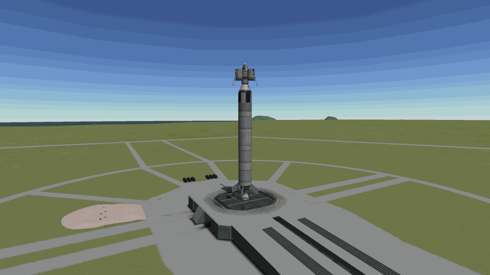
*Duna 1. On top is the lander (pod + 3 radial tanks + Terrier), below it the Poodle transfer stage.*

- **Craft**: built in the career VAB (42 parts, 84.8 t, 42.9k). In a 79×80 km low orbit it had 1197 m/s left in the Poodle stage
  and 3893 m/s in the lander. The same numbers as in the sandbox rehearsal.
- **First attempt: arrival speed 1364 m/s**: an escape burn of 1072 m/s and a 2.7 m/s correction set up a 60 km Duna periapsis. But the
  arrival inclination was 124°, i.e. retrograde. Running `correct --inc-to 10` in solar orbit stopped at a 0.1 m/s local optimum (50°
  inclination). At that distance 0.1 m/s moves the Duna pass point by about 3,500 km. So the initial grid at 0.5 m/s spacing had jumped
  right over the target. Adding a 0.05 m/s grid gave 9.7° inclination for 0.4 m/s. From 48 days before arrival the periapsis kept being
  refined, which was chasing noise. Just turning the craft produces a few mm/s, and that moves the pass point by hundreds of km (the user
  asked why the target point kept moving). Fine corrections belong inside the SOI.
  The real problem only showed inside Duna's SOI. **Arrival v_inf was 1364 m/s** (about 760 in sandbox). Capture into a 60 km circular
  orbit alone would take 966 m/s, leaving about −50 m/s for landing and return. The cause was the tooling. `transfer_planet` sized the
  escape burn to Duna's semi-major axis (20.7 Gm), but at arrival Duna was near its periapsis (19.7–20.2 Gm).
  The tuner, which only watched the periapsis, twisted the burn direction to soak up the extra energy, so the path crossed Duna's orbit early.
  A flight that should take 295 days became 194 days, and the solar periapsis was 13.33 Gm, inside Kerbin's orbit. At the escape burn,
  the encounter predicted by the node already showed an arrival inclination of 123.6°, but it was just warped past. Nobody noticed for those 190 days.
  The game offered a revert, it was a tooling bug, and crew safety was at stake, so it was **reverted to launch**. Fix: compute the escape
  burn from the target's radius at arrival time, add arrival v_inf / 10 to the tuner cost, and refuse the burn if v_inf exceeds 1.25× the
  Hohmann value + 50.
- **Relaunch** (same UT): escape burn 1055 m/s (planned v_inf 868), predicted arrival v_inf after tuning 1037, correction 3.6 m/s,
  inclination 9.3° prograde. Confirmed v_inf 1067 on entering Duna's SOI, and inside the SOI `correct --inc-to 10` for 6.3 m/s set a
  59.5 km periapsis.
- **Elliptical capture**: captured into a 59×1007 km orbit (539 m/s; the Poodle ran dry partway, separated, and the Terrier finished).
  Capturing into a long ellipse instead of a 60 km circular orbit saves about 220 m/s. It costs nothing for the landing: at the apoapsis,
  `periapsis --alt 5000` just lowers the periapsis, and that's 19 m/s. Orbital science 161 (crew report 35, goo 70, thermometer 56) plus
  an orbital EVA report 56 ("space just above Duna Lowlands") were collected and stored on the craft.
- **Landing: the script dies at 28 km**: `land` threw an exception and died at 28 km altitude, 1120 m/s (at one point tumbling at 33° per
  second). kRPC's `Parachute.deployed` raised a NullReferenceException on the lander's three Mk2-R parachutes. These chutes were tied to
  the same stage as the Terrier, so they had already been activated in vacuum during capture. Because of that the "Safe to deploy?"
  field was gone. A crewed craft was falling into Duna's atmosphere. An emergency script that wraps the parachute calls in exception
  handling and calls the same `_powered_descent` was written on the spot, and it started the powered descent at 12 km above the surface,
  925 m/s. **Landed on the Midlands at 15.71°N 156.21°E at 1.4 m/s, 9.4° tilt.** The Mk2-Rs never opened; it came down on the engine
  alone. Δv spent on landing was about 656 m/s by mass. Afterwards `_chute_deployed()` was fixed to survive this error (land, liftoff),
  and one design lesson was noted: don't put lander parachutes in the same stage as the engine, give them their own stage.
- **Waiting 600 days**: surface science 161 (crew report 35, goo 70, thermometer 56) was also stored. Fuel left: LF 376.8 /
  Ox 460.6, 7.43 t, **about 2800 m/s** in vacuum. Enough for liftoff (about 1450) and escape (about 740). The problem is the window. The
  Duna→Kerbin return window opens at **UT 22,895,340, 600.8 days from now** (297-day flight). Valentina waits landed on the Midlands until
  then, and other missions fly in the meantime.

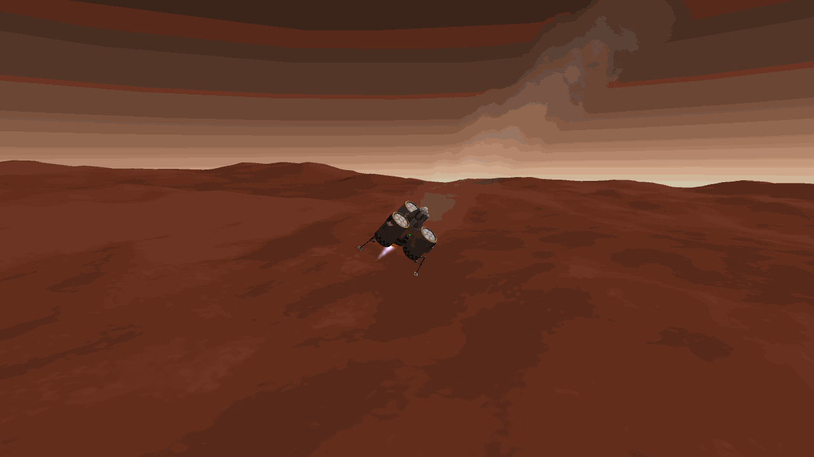
*Powered descent by the emergency script. The parachutes never opened.*

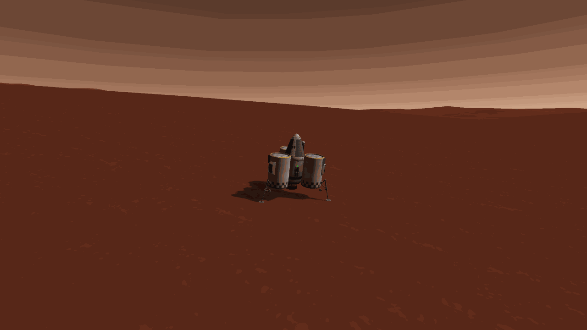
*Duna 1 on the Duna Midlands. Valentina waits here about 600 days for the return window.*

(Photos of the orbit and early descent: `docs/media/2026-09-25_duna-1_orbit.png`, `..._descent.png`)

## 7.9 Reviewing the decision process: "the command finished" is not "it went well"
Over the few hours from Duna 1 through the rescue missions, the user had to step in several times. A burn that flipped the orbit
backwards, a 17-minute wait, a Klaw that kept bouncing off. The user said the decision process itself needed to change, not a patch for each case.

- **What happened**:
  - On the contract keosynchronous relay Keo Relay 2, `match-orbit`'s apoapsis burn (1602 m/s) **flipped the orbit retrograde**
    (inclination 158°, an orbit going backwards in the same plane). The target was nearly circular (e 0.007), so the contract doesn't even
    look at the argument of periapsis (argPe), yet the cost function weighted argPe error and had no inclination term at all. The same
    burn was 523 m/s on Relay 1, and the number 1602 had been on screen 78 minutes earlier. Hours after launch, revert wasn't possible.
    It was recovered with a bi-elliptic reversal: raise the apoapsis to 9,000 km and reverse the velocity there.
  - While moving to attach the Klaw, the rescue ship's orbit sank to 64.8×80.7 km. It was a craft that couldn't finish its mission anyway,
    but to raise the periapsis it reflexively started **a 17-minute real-time wait** (inside the atmosphere, so no warp).
    The answer was revert. The user asked what the reasoning and order behind these decisions were.
  - Rescue 2 reused Rescue 1's engine-only design as is, and **repeated the bouncing grab the same way several times**. The user said to
    revert and use RCS, and then said to revert now.
  - Also: chasing noise-level corrections in solar orbit, carrying a spent SRB up to 70 km (the user spotted it on screen), and the
    landing script dying during the crewed Duna entry.
- **How the review was done**: the user judged that the previous session's judgment had degraded because of its long context, and didn't
  let that session edit CLAUDE.md itself. A new session read the incident list, LOG.md and recent commit diffs, handed the same material to
  a separate model (fable-5) for an independent diagnosis, and then reported to the user in Korean.
- **Diagnosis**: the problem was the pattern, not each incident.
  1. The "done" a command printed on its own was read as mission success. The Duna escape burn printed an arrival inclination of 123.6°
     and it was just warped past; Keo Relay 2's 1602 m/s was also visible 78 minutes ahead.
  2. No expected numbers were stated before starting a phase. With no baseline, an odd number couldn't look odd.
  3. The planner burned the node it had tuned without any check. The two most expensive errors were decided by code.
  4. Retries with no hypothesis and no limit on attempts.
  5. Side work like code and docs while a flight phase was running.
  6. 9 of the 14 memories were rules drawn from a single incident. The three that said "check the state" and "weigh the options" were
     not followed.
  The long context wasn't the main cause. The Duna error happened 13 minutes into a new session.
- **What was applied** (the user agreed to all of it): a **"How to decide" mandatory checkpoint** in CLAUDE.md. Before any burn over
  100 m/s or over 20 % of the stage's Δv, any real-time wait over 5 minutes, any retry of something that just failed, any number that
  differs from expectations, and any recovery or fix command, write one Korean progress note with four lines, then act.
  1. **Expect**: the numbers this phase should produce (Δv, periapsis/apoapsis/inclination, arrival v_inf, time) and their source
  2. **Cost**: Δv left vs. Δv needed, plus real time (rails warp only works in vacuum with no thrust)
  3. **Options**: at least two. "revert/recover" and "stop and diagnose" are always included. Can this craft still do its job?
     If not and the game offers a revert, revert now.
  4. **Stop rule**: the observation that makes you drop this option (as a number, at most 3 attempts)

  When a phase ends, compare the result with line 1, not with the command's "done". Three memories (revert-early,
  weigh-options-before-acting, observe-before-fixing) were merged into this checkpoint.
- **Code gate**: every planner's tuned node has to pass `_approve`. If the Δv exceeds 1.5× the analytic estimate + 20, or the orbit
  flips, or the periapsis goes into the atmosphere, it refuses and only leaves the node. `--plan` on `transfer`, `correct`,
  `match-orbit` and `return` stops at the node; read the predicted orbit, then burn with `ksp node`. No corrections under 1 m/s in
  solar orbit. `grab` stops after 3 contacts (`--max-contacts 3`). land, land_atmo and reentry fall back to parachutes + powered descent
  if an exception happens during descent. When waiting inside the atmosphere, say how much real time it takes. Tested offline with
  mock orbits, and the node that flipped Keo Relay 2 was refused.
- **And then it was missed on the very next flight**: right after the review, Rescue 3 flew again. `intercept` announced a 96-orbit
  phasing wait (185,664 s; at 90 km rails warp is 50×, so about 1 hour of real time), and it just waited. The checkpoint note only said
  "vacuum, warp possible" and didn't compute the wait time. Again the user caught it. Writing the four lines and actually computing the
  numbers are different things. The wait was stopped, `phase_orbit` (7.10 below) was written, and "state expected numbers including real
  time, phasing waits included" went to the top of the next-steps list in LOG.md.

## 7.10 The Klaw mystery solved: the bug was on our side
The Thud never caught in 7.7, and then the Gwenbro rescue. For hours the Klaw bounced off on every touch. The cause wasn't geometry
or speed, it was our craft builder.

- **Symptom**: in Salvage 1/2 (the Thud at Minmus) and Rescue 2/3 (a Mk1 Lander Can in Kerbin orbit, Gwenbro), slow head-on contacts
  never grabbed once. The only grab was one time Rescue 1 wobbled off axis and rammed with its nose. So the digging kept going on the
  geometry side: ray angle, flat faces, approach speed, RCS.
- **Every condition was true**: on the first Rescue 3 flight, `GrappleDebug` captured the moment of contact. The Klaw node's ray was
  hitting the Lander Can at **0.010 m, dot 1.000** for several seconds (the grab condition is under 0.1 m, over 0.733). Yet the state
  machine (FSM) stayed at "Ready". The debug was extended to evaluate the remaining conditions of the decompiled `on_contact`, KSP was
  restarted, and it flew again. Ray 0.010 m, dot 1.000, adjuster 0, relative speed 0.39–0.50 m/s (< 1), `OnCheckCondition` true.
  **With every condition true**, the FSM stayed in Ready.
- **The answer was in KSP.log**: every FixedUpdate printed "[Grapple Module] Grabbing on to Mk1 Lander Can", followed right away by
  `NullReferenceException at ModuleGrappleNode.Grapple`. Every grab attempt died on an exception, and from outside that looked like a "bounce".
- **Cause**: decompiling showed that `grappleNode` (AttachNode) is only created in `OnLoad` in the flight scene. But our CraftBuilder
  wrote no MODULE nodes at all into the .craft file (0 in Rescue 3.craft). So at launch KSP didn't call the module's OnLoad, grappleNode
  stayed null, and every grab threw an NRE. Salvage 1/2 and Rescue 2/3 are all explained by this. Rescue 1's one grab came after a KSP
  restart: the craft had been reloaded from the save, and the save has MODULE nodes. Lesson: when a stock mechanism "doesn't work," read
  KSP.log first. Hours went into geometry and speed before anyone looked at the log.
- **Test and rescue**: going out to the Space Center and bringing the craft back with `fly` made it **grab on first contact. 0 bounces,
  no NRE.** Then `transfer-crew` threw an exception (kRPC `TransferCrew` uses `crew.seat.part`, and after docking Gwenbro had no seat
  object). One more reload fixed it. The "Save Gwenbro" contract was already Complete in the save (our `contracts` command shows kRPC's
  parameter.completed = false as is; a display bug). Released the can, `periapsis --alt 30000` (48 m/s) to 30.2×89 km,
  `reentry --keep-until 300`: drogue at 20 km, main chute at 4 km at 227 m/s, service module separated at 301 m, splashdown, recovery.
  **Rescue Gwenbro complete**, funds 2.52M, reputation 340.
- **Root fix**: the user wanted a root fix, not the reload workaround. CraftBuilder now saves one MODULE node per part module from the
  prefab, like the VAB does (208 in Rescue 3.craft). The per-stage Δv/TWR in the pad test was unchanged, and a freshly launched craft
  also showed `grappleNode = True`. Crew transfer was rewritten as KspBot `MoveCrew`. It moves through the part's crew list instead of
  seats and fires onCrewTransferred (`transfer-crew --to mk1pod.v2`, not yet tested in flight).
- **Another bug from the same flight: kRPC `orbital_speed_at`**: after stopping the 96-orbit wait, the new `phase_orbit` raises the
  apoapsis for N orbits and then lowers back to a circular orbit, timed so the target arrives at the starting point (planned 6 orbits,
  apoapsis 176 km, 66 m/s × 2). But **the return burn went out as +172 m/s instead of −66 m/s.** kRPC `Orbit.orbital_speed_at(UT)`, given
  a future time, returns the speed at a different point (asking for +600 s returned the value at +0 s or +1200 s). The orbit got squashed
  to 89×482 km, and the intercept of 129 m/s came with a "correction" of 342 m/s. The plan was about 140 m/s and it used 709 m/s
  (2441 m/s left, enough for the mission).
  Fix: every `orbital_speed_at` was replaced with a vis-viva `flight.speed_at` computed from radius_at (verified). That includes match_orbit
  burns 1/2 and the plane-change intersection. Part of Keo Relay 2's 1602 m/s was very likely due to this too. The recovery burn on a
  hyperbolic orbit in 7.7 that pushed backwards was the same function. Rendezvous intercept/correction burns now also go through `_approve`
  (this time's 129 m/s (expected about 6) and 342 m/s would have been refused). `phase_orbit` doesn't continue if the returned orbit is
  squashed. Holding distance before docking: 51.7 m.
- **Proven in flight: Rescue 4 (Mitbro in Minmus orbit)**: the first craft made with the fixed builder. Rescue 3 plus a Communotron 16-S
  (the OKTO's built-in antenna doesn't reach Minmus). The transfer burn was 930 m/s (expected 921); the Swivel stage separated mid-burn,
  throwing the encounter off, and 27 m/s brought it right back. Capture 218 m/s (expected 216), 57.3° plane match 90.7 m/s, intercept and
  correction 33 m/s. And **a craft fresh from launch grabbed on first contact without a reload. No NRE either.** The first use of
  `transfer-crew` (MoveCrew) moved Mitbro into the pod, and the contract condition in the save turned Complete. On the way home the gate
  compared `return --plan`'s 224 m/s with "expected 40" and refused it. This time it was the estimate that was wrong, not the burn (it left
  out the v_inf needed to lower the Kerbin periapsis). Fixed the formula and burned. Landed on grassland at night, **Mitbro rescue
  complete**, funds 2.84M, reputation 368.

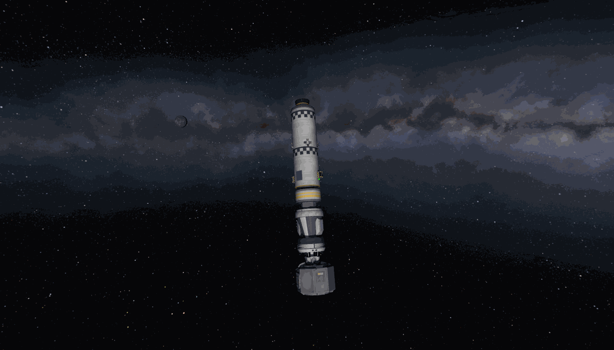
*Rescue 3 holding Gwenbro's Mk1 Lander Can (below) with the Klaw. It grabbed on first contact after a reload.*

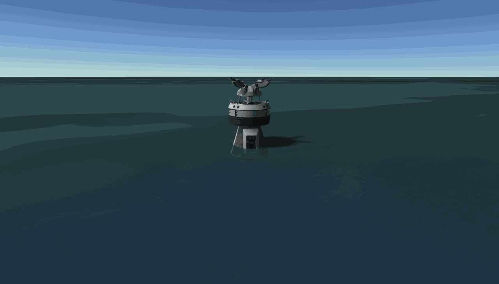
*Rescue 3's pod down in the sea with Gwenbro aboard. The Klaw is on its nose.*

## 7.11 Eve 1: the first interplanetary broken-plane transfer
After the rescue missions there were only 45 science points. The next tech nodes cost 160–550. An opus subagent parsed the save
and surveyed the science situation. High-space science had never been taken at any body. Orbital EVA reports count separately for
each biome. The funds-to-science strategy was worth about 1 point per 10k, useless. And the Minmus surface materials experiment was
0/125 in all 9 biomes (what happened to the roughly 500 points thought to be taken in 7.6 is solved in 7.12). So the plan became to go
get science at Eve, where nobody had been yet. The pilot was Jeb.

- **Craft**: Duna 1 minus the legs and lander parachutes, plus one more set of goo and thermometer and 2 barometers (for high and low
  space). Struts across the whole stack (84.6 t, 40 parts, 44.5k). The ascent was quiet, with rotation rates up to 1.6°/s and max Q
  33 kPa. In a 79.4×79.7 km low orbit: Poodle 1251 + Terrier 4105 m/s.
- **First attempt: the planner can't reach Eve**: `transfer Eve --plan` couldn't find an encounter. The tuner, trying to shrink the
  closest approach, inflated the escape burn to 1172 m/s (v_inf 943, Hohmann about 780). The solar periapsis was 9.14 Gm, inside Eve's
  orbit (9.83), and a radial component put the escape periapsis at 67 km, inside the atmosphere. The `_approve` gate added in 7.9
  **refused this node. The first time the gate caught something in a real flight.** The cause was Eve's 2.1° orbital inclination. A search
  that only picks starting points within our orbital plane can't find a path that leaves the plane. It never showed at Duna, whose
  inclination is 0.06°.
  In the same flight, `eva out` in low orbit was also blocked with "hatch obstructed". A barometer had been placed at 90°, i.e. on the Mk1
  pod's hatch. The design guide already said so, but it wasn't checked. With no EVA science and a planner to fix, it was
  **reverted to launch**. The instruments moved to 225/270/315°, and EVA exit and boarding were checked on the pad.
- **Planner redesign (fable)**: from an equatorial low orbit, a single escape burn can't match Eve's orbital plane. When the window
  opens, Eve arrives 347 Mm away from our orbital plane (Eve's SOI is 85 Mm). A single-burn 3D Lambert solution needs an escape asymptote
  declination of 48–66°, which costs about 2180 m/s. So a **broken-plane transfer** was added. Solve Lambert (universal variable) to the
  target's arrival position projected onto our orbital plane. Sweep flight times over 0.6–1.4× Hohmann and pick the one with the smallest
  sum of escape + capture + estimated mid-course plane change. The node only tunes the prograde, time and normal components (without the
  radial component, the escape periapsis stays at the burn altitude). If the target is farther from our plane than its SOI, print the
  mid-course correction time and expected Δv. Verified offline from body data alone. The Eve window: 184-day flight, v_inf 790,
  escape about 1040, plane change about 413 m/s (UT about 14,211,384), arrival v_inf 919. The Duna window has only a 20.5 Mm plane
  difference, so it stays on the old path.
- **Second attempt**: on the first `launch` connection KSP quietly shut down (KSP.log just stopped). It had been saved a minute before,
  so nothing was lost. After a restart: same low orbit, same Δv. In the **first real use of the Lambert transfer** the planner printed
  "184-day flight, v_inf 790, escape about 1040, Eve out of plane −347 Mm, plane change about 413". Exactly the offline numbers. The tuned
  node was 1027 m/s, v_inf error 0.0, Kerbin periapsis 79.6 km, solar periapsis radius 9.80 Gm (Eve is 9.73–9.93), and it was burned as is.
  Transmitting high-space science in solar orbit (crew report, thermometer, barometer) took science from 45 → 65.
- **Mid-course plane change**: planned for UT 14,211,457, done at 14,210,478, `correct Eve --plan` gave 371.6 m/s (expected at most 413).
  Result: Eve periapsis 147 km, v_inf 815 (planned 919), inclination 10°. The Poodle ran dry mid-burn and the Terrier took over, but the
  encounter held (periapsis 146.7 km). This also revealed that `correct`'s gate had been comparing the node with itself. Effectively
  there was no gate. Now the seed's analytic Δv is the expected value.
- **No signal at Eve**: the Communotron 16 (500 km) combined with DSN level 2 gives a range of about 159 Mm, and Kerbin was 9.5 Gm away.
  Nothing can be transmitted. All the science has to ride in the pod and come home with Jeb.
- **Turning the arrival plane with an aim-point seed**: entering Eve's SOI, the high-space set was taken (crew 25, goo 50,
  thermometer 40, barometer 60). The return window was 528 days away (UT 27,264,701), so capturing into a polar orbit and touring biomes
  paid off. But `correct --inc-to 90` only managed 11° of inclination for 0.9 m/s. A ±6 m/s grid doesn't turn the aim point. A new
  `_aim_point_seed` was written. It rotates the impact vector around the incoming asymptote through 36 angles, checks each with KSP's orbit
  patches, and then tunes. Seed 73 m/s, 68.5 m/s after tuning, giving 73.1° inclination and 142 km periapsis. It didn't reach 90° because
  of the tuner weights (periapsis km vs. inclination/5).
  Capture `--apo 40000000` took 127 m/s (expected 127) into a 142×40,200 km orbit, 3762 m/s Δv left.
- **Biome tour**: on the capture pass the low-space set (goo 70, thermometer 56, barometer 84) and an EVA report were taken. Then a
  script ran on every periapsis pass: warp to 395 km, send Jeb outside, do an EVA report every time a new biome came up below 400 km, and
  bring him back in. 7 passes took **11 of 15 biomes** (56 points each). The ground track never crossed Olympus, Craters, Akatsuki Lake or
  Western Sea, and it stopped per the stop rule "3 passes with nothing gained." The science in the pod is experiments 385 + EVA 616 + 16,
  about **1017 points**. Only paid out if Jeb gets home.
- **The return is still homework**: in a 142×40,000 km polar orbit, the periapsis fixes the direction of the escape asymptote. The orbit
  has to be rotated at the slow apoapsis to move the periapsis under the needed asymptote, then escape at the periapsis with about 200 m/s,
  then do another broken-plane mid-course change. The current `transfer_planet` assumes a circular parking orbit, so it needs work before
  the window (UT 27.2M).

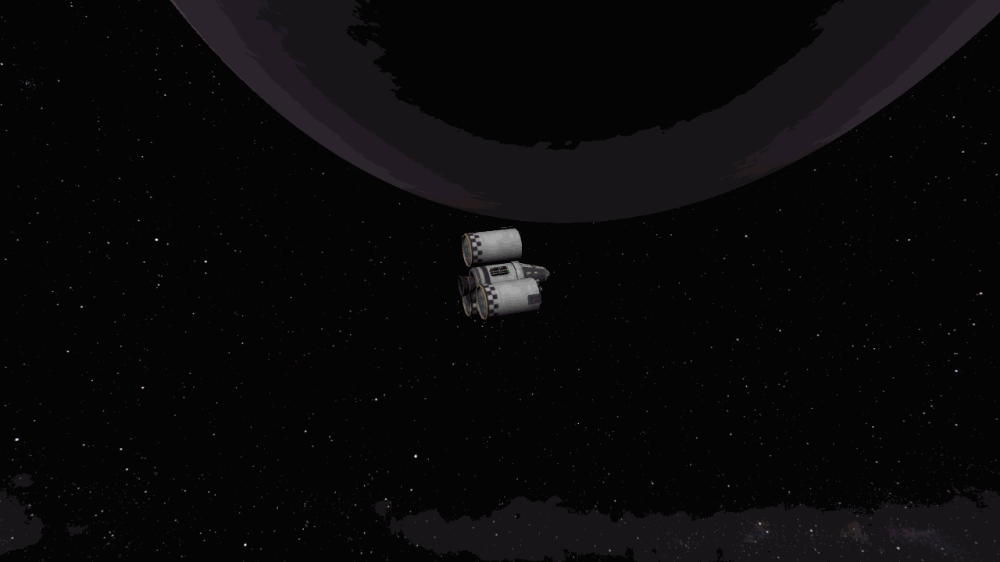
*Eve 1 (Jeb) in Eve orbit. The dark purple disk at the top is Eve. It carries about 1000 science and waits 528 days for the return window.*

## 7.12 Minmus Science 2: what happened to the missing materials science
The survey in 7.11 turned up something odd. Minmus Science 1 (7.6) printed "materials 100" at every biome, but in the save the Minmus
surface materials experiment was 0 in all 9 biomes. The hypothesis while preparing Eve 1 was that the storage box's Collect All had
taken the non-rerunnable Science Jr data and lost it. That hypothesis was wrong.

- **What it was**: the save had no `mobileMaterialsLab@MinmusSrfLanded*` entries at all. Decompiling ModuleScienceContainer and
  ModuleScienceExperiment showed that Collect All treats goo and the materials experiment exactly the same. And the goo from the same
  flight did count. So the mechanism wasn't the problem. The "materials 100" MS1 printed at every biome was the copy run in orbit (the
  low-orbit value) that it kept carrying around. There was never any surface data. This time, the storage box's "Review Stored Data (N)"
  count gets checked at every biome.
- **Craft**: the Duna 1 lander (with legs) on the Eve 1 launcher, with 5 Science Jrs stacked under the pod decoupler. 6 goo, barometer,
  thermometer, storage box at 135° (85.9 t, 56.5k). In a 79.3×79.5 km low orbit: Poodle 1010 (expected about 1130), lander 3296 m/s.
  Jeb was in Eve orbit, so launching under his name made the command hang (exit 124). Relaunched with Bob.
- **A contract accepted before reading**: a temperature survey contract for 4 surface sites on Minmus was accepted before reading the
  check rule. A surface survey's trigger radius is **500 m** (SurveyWaypointParameter.TriggerRange). Our landings come down somewhere within
  about 2 km. Money isn't the bottleneck, so it wasn't flown. `land --at LAT LON`, which lands on the first pass within 2 km of a point,
  was written but not used yet.
- **Arriving at Minmus**: transfer 936 m/s (expected 921). After the burn the encounter was off again (apoapsis 57,553 km, planned 59,298;
  the same symptom as Rescue 4). 3 m/s restored the periapsis. Inside the SOI, `correct --inc-to 90` with the aim-point seed, 23 m/s,
  inclination 91°. Capture 207 m/s (expected 207) into a 12×16 km polar orbit, lander 3135 m/s.
- **An EVA failure almost wasted every experiment**: `eva out` failed twice ("hatch obstructed?", spawnEVA null). Compared with Eve 1,
  the only new side part was the storage box at 135°, 45° from the hatch. The bigger problem came next.
  `eva report` didn't check whether a kerbal was on EVA and **ran every experiment on the craft.** 5 Science Jrs and 6 goo were used up in
  high space. These are one-shot experiments. Decompiling found a stock "Reset" event. It's enabled when the experiment is deployed, can't
  be rerun but can be reset, and its data hasn't been collected yet. That brought them all back, leaving only one goo's 25 points. Now
  `eva report` only runs when the active vessel is an EVA kerbal.
- **5 landings**: landed with `land --biome`, returning to polar orbit in between with `liftoff --heading 0`. Lowlands 250 m/s,
  Poles (83° north, 10° slope) 515, Flats 537, Highlands 520, Lesser Flats 521 (liftoff + landing combined). Each biome gave materials 125,
  goo 50 (11.5 where it was already taken), barometer 60, thermometer 13, and the storage box count was seen growing 4 → 9 → 14 → 19 → 24 → 29.
  Slopes was left out for lack of Science Jrs and fuel.
- **The return planner picks a retrograde solution**: `return --plan` gave 229 m/s (expected 163). The Kerbin arrival inclination was
  133°, retrograde. The seed was (v_esc − v_circ) × 1.15 = 70 m/s, too small, so the burn time was effectively arbitrary, and the cost
  function couldn't tell the two solutions apart. The seed was set to the expected size and retrograde arrivals got a 1e4 penalty. The
  replan was 164 m/s, inclination 32°. The 36 km periapsis was trimmed to 30 km for 2 m/s and it reentered. The storage box skin reached
  1774 K (limit 2900 K; other side parts about 460 K) but held, it splashed down, and Bob was fine.
- **Results**: science **84 → 1250**. Researched the science lab (advExploration), advElectrics, electronics (HG-55 antenna,
  magnetometer), specializedConstruction (docking), scienceTech (atmosphere analyzer), advLanding. As a bonus, one fact for the Eve 1
  return: side parts next to the pod survived a reentry at Minmus return speed at about 460 K. Eve 1's 385 points of experiment data
  also ride on parts like that.

## 7.13 Survey 1: 1600 points without landing
Looking at the save again, the space subjects were almost empty. Orbital EVA reports per biome at the Mun and Minmus, the
magnetometer (base 45 × body multiplier), a high-space set at each body. One crewed orbiter could take all of it without landing.
The pilot was Bob again.

- **Craft**: the Eve 1 stack with the pod side parts only at 225/270/315/0° (hatch spot left empty, storage box at 315°). 3 Science
  Jrs, and the magnetometer boom on the Terrier tank. In a pad EVA test the exit worked, but Bob floated up off the pod and fell onto
  the pad (Ragdoll, survived). To get him back aboard it was **reverted to launch**. In low orbit: Poodle about 1050 + Terrier 3623 m/s.
- **Aim-point seed v2**: Mun transfer 865 m/s (expected 857). After the burn the Mun periapsis was −5.6 km and the arrival orbit was
  retrograde equatorial. The aim-point seed from 7.11 (a straight-line b/t approximation) only reached 167° inclination when used in
  Kerbin orbit, because outside the SOI a burn doesn't move the aim point by Δv × t. v2 solves for the minimum-norm burn using a numerical
  Jacobian of the impact vector KSP itself predicts (3 test nodes, one relinearization), and checks 36 aim angles against real orbit
  patches. Result: 98° inclination for 116 m/s. A normal burn near the node line right after the transfer has little leverage and was
  expensive, but the budget (about 3800 vs. about 1200 needed) was generous, so it was accepted. In Kerbin high space all 7 subjects
  including the magnetometer 67.5, plus the Mun high- and low-space sets, were taken. Capture 279 m/s (expected 279), 14×17 km.
- **The magnetometer takes 7 seconds**: `do_science` collected data after 1.5 s, but the magnetometer takes about 7 s to report. The next
  call saw the half-finished experiment as "useless data" and reset it, and the Mun low-orbit magnetometer value was lost once. Now it
  waits up to 20 s until every started experiment has produced data. Rerun for 135 points.
- **Biome tour by ground track**: a new script predicts the ground track, finds the next time it enters a biome not yet taken, warps to
  the middle of that pass, and does EVA, report and boarding. Low-orbit EVA reports for **all 17 Mun biomes** were taken.
- **A silently blocked boarding**: the printed report titles were one step behind the actual subjects. The save showed PolarLowlands and
  NorthwestCrater stored under different titles. Then one duplicate report made the pod reject the kerbal's data, and KSP raised the
  "Cannot store experiments / Board anyway" popup (KerbalEVA.checkExperiments). `eva board` did nothing, with no error. Dropped the
  duplicate, boarded, and closed the popup.
- **Mun to Minmus: the polar orbit blocks the way**: calling `transfer Minmus` from Mun orbit was generalized into a moon-to-moon transfer
  going through `transfer_planet`. Three problems came up. (1) The window search looks back 40 days, and a Mun→Minmus window comes every
  7.4 days, so it picked a window five periods ago. The look-back was cut to 0.15 periods or less. (2) From a Mun polar orbit, the needed
  escape direction (the direction of the Mun's orbital velocity) was 76° off our orbital plane. That direction lines up twice per Mun
  orbit (1.8, 5.0, 8.2, 11.4, 14.6 days), and the window came at 14.8 days. (3) `transfer_planet` matches the velocity at the SOI boundary,
  and when the SOI is small that isn't v_inf (for the Mun, 2μ/r_SOI = 53,600 m²/s², comparable to v_inf²). The plan came out with apoapsis
  31,773 km and inclination 23°, so it wasn't burned. Raised the orbit to 400 km (117 + 90 m/s) to warp through the 14.2-day wait quickly,
  and ran closest-approach tuning from a 159 m/s seed, giving a Minmus periapsis of 21.5 km and inclination 80° for 161 m/s. Arrival v_inf
  was 233, so capture took 165 m/s instead of about 100.
- **Minmus**: high-space magnetometer 112.5 and EVA 20. Skipped the 22.6 m/s to trim inclination to 90°; 80° still reaches the Poles.
  Capture 165 m/s into 21×22 km, low-space magnetometer 180, and the biome tour took all 8 missing biomes (Midlands was already there).
- **A 36-minute warp**: for the return burn the gate refused 365 m/s (expected 163). Same plane problem: Minmus's orbital velocity was 58°
  off the polar plane. It waited 8.2 days for alignment, but in a 22 km low orbit the warp rate is low, so it took **36 minutes of real
  time**. At the Mun the orbit was raised first, here it wasn't. Then 160 m/s gave a Kerbin periapsis of 36 km. Every return burn from a
  moon comes out with the periapsis 6 km high; this is the third time. Trimmed to 30 km for 1.8 m/s, reentered and landed in the Highlands.
  The storage box held 44 items, and science went **11 → 1613**.
- **R&D level 3**: upgraded R&D to level 3 to open nodes over 500 points (1.69M). Researched fieldScience, advScienceTech (ISRU,
  drill, gravioli detector), largeVolumeContainment (3.75 m), commandModules (Mk1-3 pod), largeElectrics. Funds 1.26M, science 3.
- **Lessons**: a polar orbit around a moon locks the escape direction. Plan the departure around plane alignment (twice per moon orbit)
  or leave from an equatorial orbit. Before a long wait, raise the orbit first for faster warp.

## 7.14 Rescue 5: three at once
- **Gwenbro, supposedly rescued, was still in orbit**: Gwenbro, whom 7.10 had written up as "rescued" by Rescue 3, was still Assigned on
  the roster, and "Gwenbro's Derelict" was still orbiting with her inside. There were two vessels with the same name. The empty one was
  the can Rescue 3 had released. Rescue contracts for scientist Daphrick and pilot Jedgard in low orbit were accepted too. All three were
  in 75–88 km equatorial low orbits.
- **Craft** (crafts/rescue-5.json): a Klaw on top of a 3-seat Mk1-3 pod, a heat shield (HeatShield2) below, 3 Mk2-Rs + 3 drogues.
  Uncrewed control from an OKTO in a 1.25 m service stack below a C7 2.5 → 1.25 adapter tank (with RCS), engine a Terrier. The launcher
  is Eve 1's. In the first build the pod decoupler was in the same stage as the Terrier, a layout that would have dropped the pod the
  moment it ignited. Caught before launch. Low orbit 79.6×79.9 km, Poodle 887 (separated) + Terrier 2158 m/s.
- **The first grab caught the empty can**: when kRPC looked up the vessel by name it picked the empty can. Released it, renamed it "Empty
  Can (Rescue 3)", and went to the real can. After that every grab caught on first contact. 0 bounces. The MODULE node fix from 7.10 is
  holding. `transfer-crew --to mk1-3pod` three times moved all three into the pod.
- **The rendezvous refused twice**: "orbits too similar to phase, change altitude by 5 km or more". So first up to 95 km, then 110 km
  circular orbits. Each rendezvous cost about 110–160 m/s (2 phasing orbits × 45–60 m/s). After a refused rendezvous, the grab and crew
  transfer chained with `a && b && c` still ran (no harm this time). At first it looked like the CLI printed ERROR and still exited 0.
  Testing before the next flight, the CLI did return 1. The `| tail` pipe at the end had swallowed the exit code.
- **Return**: periapsis 30 km, `reentry --keep-until 300`, splashdown, recovery. **Two rescue contracts complete**, funds 1.33 → 1.44M,
  reputation 407. KSC now has scientists Bob, Gwenbro, Daphrick, engineer Bill, pilots Mitbro, Jedgard. Jeb is on Eve 1,
  Valentina on Duna.
- **Two offline designs in the meantime**: fable designed the Eve 1 return (`kspbot/kepler.py`, `depart`, `tools/plan_eve_return.py`).
  In a 142×40,000 km orbit the escape direction is tied to the apoapsis direction. At the Hohmann window that direction is 138° off Eve's
  orbital direction. The cheap way is to wait 8 periapsis passes after the window. Tilt the plane at the apoapsis (105 m/s, UT
  28,925,295), then escape tangentially at the periapsis (215 m/s, UT 29,029,189). 298-day flight, arrival v_inf 2142 (entry speed about
  3.9 km/s), about 320 m/s total. opus researched how the science lab works (`docs/lab/README.md`). Material for the next section.

## 7.15 Minmus Lab 1: a science station in Minmus polar orbit
Instead of taking science once and being done, a device that keeps earning was sent up. The mobile processing lab (MPL-LG-2) turns
experiment data you put into it into science points over time. It went into a 14 km Minmus polar orbit with scientists Bob and Gwenbro aboard.

- **Tooling first**: lab controls were added to KspBot. Status, a precomputed processing result (the same formula as the results
  window), start, stop, transmit, clean. From the CLI: `ksp lab status|dry|process|start|stop|transmit|clean`.
- **Craft**: docking port (Clamp-O-Tron), OKTO, Science Jr, 3 Z-1k batteries, reaction wheel, MPL-LG-2, C7 adapter tank (2 goo,
  thermometer, barometer, gravioli detector, storage box, HG-55 antenna), FL-T400 (2 Gigantor solar panels, magnetometer, 2 Z-400
  batteries), Terrier. The launcher was Rescue 5's (7.14) as is (87 t, 75k).
- **Pad EVA tests killed people twice** (both reverted): the moment a kerbal appears at the MPL hatch, the whole craft gets kicked once.
  In 0.5 s the tilt went from 0 → 3.6° with 1 m/s of velocity, and the 87 t rocket fell over on the pad. `eva check`, which looks for
  other parts' colliders within 1 m of the hatch, was written, but this craft had no overlapping parts (now an overlap refuses the EVA
  outright). Measured in low orbit, an EVA from the MPL adds about 6°/s and 0.08 m/s to the floating station (normally 0.02°/s). With
  the station's SAS on, it settles to about 2°/s in 8 s and the kerbal stays on the ladder. So the rule: do orbital EVAs with SAS on,
  and **no pad or surface EVAs from the MPL.** The "kerbal flung off during a surface EVA" accident in section 7 was very likely the same
  kick. The kick changes the orbit too. In a long elliptical orbit with only 7.5 m/s at the apoapsis, one EVA dropped the periapsis from
  14 km to −5.5 km, and the 9 EVAs of the biome tour turned a 13×15 km orbit into 7.8×15 km.
- **First ascent: flipped in the air** (revert): at 14 km altitude and 24 kPa dynamic pressure, the moment the Mainsail separated it
  started spinning, reaching 94°/s within 5 s, fell into the sea, and the crew died. On the same launcher Rescue 5's small, blunt pod
  flew fine. The long, light payload (MPL + 1.25 m stack + the Gigantor on top) had pulled the center of pressure forward. Added 4 AV-R8s
  on the Skipper tank and 4 AV-T1s on the Poodle tank, and moved the Gigantor down to the FL-T400. The second ascent was quiet. Low orbit
  79.3×79.5 km, Poodle 791 + Terrier 2200 m/s.
- **Kerbin science into the lab first**: the Kerbin low-space set (EVA Grasslands, goo, materials, thermometer, barometer, gravioli,
  magnetometer) and the high-space set went straight into the lab (159 + 240 data). `lab clean` resets the goo and materials experiments
  for reuse (cleaning takes about 70 s at 1× speed). Transfer 922 m/s (expected 921).
- **Arriving at Minmus: periapsis 1660 km, not 15 km**: after the transfer the encounter was off again, with the EVA kick in Kerbin high
  space adding to it. Instead of paying 170 m/s to move the aim point, it captured into a 1653×2062 km orbit on the 1660 km pass (204 m/s)
  and at the apoapsis turned it into a polar plane + 15 km periapsis in one go (27.2 m/s, an ad-hoc script). After an EVA kick the
  periapsis was reset (2.1 m/s), and circularization for 61 m/s gave 12.9×13.3 km, inclination 92.7°. 1774 m/s left in the Terrier.
- **The capture burn didn't fire**: throttle 1 but thrust 0, control state "none". The CommNet signal requirement (7.7) was on, and the
  HG-55 antenna hadn't been extended. The OKTO's built-in antenna only reaches about 16 Mm and Minmus is at 47 Mm. Extending an antenna
  works even without control, so as soon as it opened, signal 1.0 and control came back. That was 6000 s before leaving the SOI. Lucky.
  "Refuse the burn if control is none" went onto the next-steps list.
- **Biome tour and first transmission**: collected the Minmus high-space set, low-space set and all 9 low-orbit biomes (an EVA report +
  gravity scan per biome, 6 s of stabilizing with SAS on). The lab is at 720/750 data, 9.7 points per day. The remaining ~1,500 data
  (magnetometer, materials, gravity scans 9 × 100, EVA reports) stay in the storage box to top up later or carry home. Transmitted gravity
  scans only get 40 % credit. Lab transmission took science **2.6 → 146.4**. Periapsis raised to 13.6 km (3 m/s).
- **The lab's pace**: a lab filled with 720 data eats about 2 data per day and produces about 10 points. About 500 points in 50 days.
  So it gets visited (switch to the vessel and transmit) and emptied at least every 50 days.

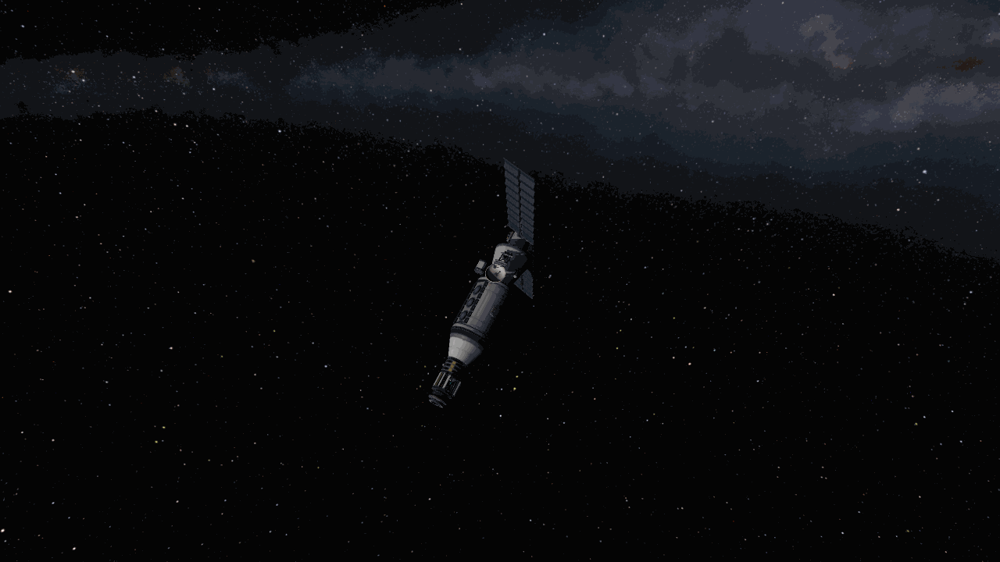
*Minmus Lab 1 in Minmus polar orbit. The white cylinder in the middle is the MPL lab, the panels at the top are Gigantor solar panels. Bob and Gwenbro are aboard.*

## 7.16 Contract mix-up: trying to take a keosynchronous contract, getting an Ike station instead (Keo Relay 3)
- **The wrong contract**: a keosynchronous relay contract was accepted with `accept "keosynchronous"`. The accept went through, but the
  save right after it threw an NRE (NullReferenceException) and the CLI printed ERROR. Thinking it had failed, it ran `accept 4`, but the
  list order had shifted in the meantime and the **"Build a new station in orbit of Ike"** contract got accepted. The scene change that
  followed half-reread an old save. Funds went back to 1.368M, a contract object was "active" yet sitting in the offered list, and calling
  accept() did nothing. `load-save` didn't clear it; restarting KSP did. Both contracts were back to offered, nothing lost.
  The cause comes out in the next section (7.17).
- **So both were taken**: this time the keosynchronous contract (48.5k + 124k) and the **Ike station** were accepted together on purpose.
  The Ike station pays 303.6k in advance and 905.6k on completion, 349k on failure, with a deadline of about 41 years. Requirements: 9
  kerbals in Ike orbit, ISRU, cupola, antenna, docking port, power. It fits the long-term Duna + Ike goal. `accept` now prints the contract
  title first, and if the save fails it only warns instead of retrying.
- **Keo Relay 3**: Keo Relay 2 (the craft whose orbit flipped retrograde in 7.9) with the goo swapped for a GRAVMAX gravioli detector
  (30.3k). Target orbit: inclination 4.24°, eccentricity 0.057, semi-major axis 3463 km, LAN 95.64°, argument of periapsis 299.63°.
  Launch azimuth 85.4°, low orbit 82.6×87.7 km (inclination 3.94°). `match-orbit` spent 12.9 on the plane, 647 on the periapsis side
  (expected 643–647) and 457 m/s on the apoapsis side, and the result was semi-major axis 3461.7 km, eccentricity 0.0567, inclination
  4.24°, LAN 95.67°, argument of periapsis 299.73°. This time the numbers came out as expected. **Contract complete**, funds 1.72 → 1.81M,
  science 146 → 154. One fix: `--plan` stopped at every sub-1 m/s fine correction of the first burn; now corrections under 2 m/s are
  skipped. Keo Relay 3 has 4617 m/s left and can serve as a spare relay or a tug.

## 7.17 Duna 1 lifts off, and what the "can't save" bug really was
- **First lab visit**: at UT 22.85M, after 40 days, the lab showed "Science Full" at 497.9 points. `lab transmit` (about 2,000 electric
  charge, about 1 minute) took science **154 → 652**. Refilled with the storage box's materials experiment 125 (745/750).
- **Ike Station 1 design** (not flown yet): designed offline by fable. 134 t, 72k. Twin-Boar + S3-3600 / Skipper / a Poodle transfer
  stage kept attached all the way. Cupola + 2 Hitchhikers for 9 seats, Convert-O-Tron 125, 2 HG-55s + RA-15, Clamp-O-Tron.
  **Kerbin → Duna window UT 25,054,465**, about 2250 of about 2900 m/s after low orbit planned to be used. Tooling gaps the design doc
  listed: extending solar panels, moon transfers from an elliptical orbit.
- **Duna 1 lifts off**: Valentina (7.8), who had waited about 600 days on the Midlands, finally left. `liftoff --alt 60000 --heading 90`
  → 59.2×59.5 km, inclination 15.7°, 1421 m/s used (expected about 1450), 1386 m/s left. Then `transfer Kerbin --pe 30000 --plan` warped
  toward the window (UT 22,895,340, 2.1 days away), but the warp limit in a 60 km Duna orbit made it effectively about 4×. In 25 real
  minutes 5,800 s of game time passed, and the command died on its timeout. The same kind of mistake as the 36-minute warp in 7.13. Wait
  for distant windows at the Space Center (`scene space_center` → `warp-sc` → `fly`).
- **What the save NRE was**: the contract mix-up in 7.16 was caused by this bug, and it happened again after the Duna 1 flight (`fly`
  saves first and hit the NRE). It hit 2 of that day's 6 flight → Space Center transitions. The user said "find the cause first, and fix
  it only if it needs fixing." fable diagnosed it from the Unity log and decompiled KSP/kRPC code (`docs/save-nre-diagnosis.md`), and opus fixed it.
  - **One flag gets left behind**: KSP has a global flag (`FlightGlobals.ready`) meaning "the flight scene is ready and there is an active
    vessel." Requesting a scene change lowers this flag. But the flight scene's physics update raises the flag again if there is an active vessel.
  - **One extra physics step runs**: Unity computes physics in 20 ms (50 Hz) steps. If a frame takes longer than 20 ms, several physics
    steps run inside that frame. kRPC executes our commands inside these physics steps. So even if kRPC requests the scene change in the
    first step and the flag drops, if there's a second physics step in the same frame, the flight scene that's still there raises the flag
    again. Then the flight scene is torn down and the active vessel is gone, but the flag goes over to the Space Center still raised. The
    Space Center has no code that lowers this flag. The stock game changes scenes from menus (after the frame's physics steps are done), so
    it never hits this ordering. It tends to happen right after a warp, with many vessels (about 49), and when memory is tight and Windows is slow.
  - **Evidence**: in the log, "Reference Frame: Rotating" appears right after "Scene Change : From FLIGHT to SPACECENTER".
    That line is only printed inside a physics step while the flag is raised. The three normal transitions didn't have it.
  - **Why the save dies**: the save code says "if the flag is raised, write the active vessel's index." The flag is raised but there's no
    vessel, so NRE.
  - **Why the career rewinds**: when saving, KSP writes the flight state first, then updates in-memory snapshots such as funds and
    contracts. If the flight state throws an NRE, the snapshots aren't updated. The next scene change rebuilds funds and contracts from that
    stale snapshot. That's why funds went back to 1.368M, contracts went back to "offered", and time rewound too. On top of that, kRPC caches
    contract objects by ID, so our side got dead old contract objects back. That's why accept() did nothing. Restarting KSP empties the
    cache, but `load-save` leaves the kRPC server running, so it didn't. The save on disk was not damaged, because while it was broken no
    save was ever actually written.
  - **Fix** (KspBot + CLI): a SceneGuard that lowers the leftover flag on every Update outside flight. A `Save` procedure that never throws
    and returns ok/error, used by every CLI save; if it fails, the command stops. Scene changes (`SwitchScene`) save first, then open the
    Space Center or Tracking Station from a coroutine in the Update phase, not in a physics step. `ksp scene` waits for the load, then tries a
    test save. `recover` still changes scenes in a physics step, but the guard fixes the flag at the Space Center.
  - There was a way to recover even without the fix. Going to the Tracking Station and back to the Space Center lowers the flag. The cost
    is losing whatever happened since the last good save. That's how it was recovered (back to UT 22,856,293, losing only one warp at the Space Center).
- **KSP didn't come back up**: `install.sh`, installing the fix, saved the game and shut KSP down, but **KSP didn't come back up**. The
  second time that day (launching through Steam after taskkill sometimes does nothing). Windows memory was high again (5.4 GB available,
  commit 20.3 / 33.8 GB, nonpaged pool 1.81 GB). The user restarted the PC.

## 7.18 After the PC restart: fix confirmed, Duna 1 heads home, Rescue 6
- **Fix confirmed**: before starting KSP, Windows had 15.4 GB committed, nonpaged pool 0.89 GB, 3.6 GB available. `status` showed
  flightGlobalsReady false, and Tracking Station, Space Center and flight → Space Center transitions all printed "test save ok"
  (8 transitions that day, 0 failures).
- **Duna 1 escape**: this time it warped at the Space Center until just before the window (`warp-sc 22893000` → `fly`). `transfer Kerbin --pe 30000
  --plan`: Lambert 675, **762 m/s** after tuning (expected about 740), Kerbin encounter periapsis 9,121 km, inclination 88.6° → burned.
  Residual 0.2 m/s, 623 m/s left. Leaving Duna's SOI: Kerbin pass periapsis 11,514 km, inclination 56.5°, Kerbin SOI entry at UT 29,273,095.
- **An 80 m/s correction left unburned**: right there, `correct Kerbin --pe 30000` planned 80 m/s. The reason was geometry.
  A burn that tilts the orbital plane rotates the plane around the line through the burn point and its opposite point. It departed from
  Duna's apoapsis side, so the arrival point was 178° ahead, almost on that axis. A point on the axis doesn't move when the plane tilts. So
  Kerbin being 14 Mm out of the plane couldn't be erased cheaply (even a fine grid of ±1, ±15 m/s only got the periapsis from 11.5 → 8.5 Mm).
  Doing it at **UT 26,854,269**, 90° before arrival, is expected to take about 10 m/s (matching the plane change of about 10 in the Lambert
  output). Now `correct` refuses corrections over 20 m/s far out when the arrival point is more than 135° ahead, and reports that UT. The
  aim-point seed also died during this calculation (all 36 tries lost the encounter). Now it falls back to another method in that case.
- **Tooling**: solar panels deploy together with the antenna after `circularize`, and fold before `land`.
- **Rescue 6 contracts**: rescue Elfry in low orbit (52k), and recover Barzor and his Mk1 Lander Can in a 6.7×7.7 km equatorial Minmus
  orbit (204k). The craft is the same as Rescue 5 (Mk1-3 pod with a Klaw on top, uncrewed control by OKTO). But `launch` automatically put
  Bill, Mitbro and Daphrick into the empty pod. Recovered on the pad and rolled out again with `--crew none`.
- **First attempt reverted** (tooling bug): Elfry's pod was grabbed fine. But `transfer-crew --to mk1-3pod` mistook Elfry's Mk1-3 pod for
  "our pod" (same part name). Nobody was moved, and the following `release` let Elfry go as is. Trying to grab again, grab refused with
  "too close to turn," so an ad-hoc script backed off with RCS. That script ended with SAS and RCS still on, and the next grab's autopilot
  fought them both for 10 minutes (5–28°/s oscillation).
  Monopropellant 150 → 0, battery 360 → 0, control none, spinning at 12°/s in darkness. Without RCS there's no grabbing at Minmus, so it was
  **reverted to launch**. Fix: `transfer_crew` only moves crew from the part below the Klaw and checks that they arrived. `grab` first turns
  off SAS/RCS, and if too close, backs off with RCS translation.
- **Second attempt**: 99.4×99.7 km (Poodle 856 + Terrier 2158), rendezvous about 100 m/s, grabbed with 0 bounces, moved Elfry and released
  the pod. Then `transfer Minmus --plan` came up with **1094 m/s** and a Kerbin escape trajectory. At arrival time Minmus would be 3.9 Mm
  off Kerbin's equatorial plane (Minmus inclination 6°, SOI 2.25 Mm). Leaving 17–18 days later shrinks that gap to under 0.4 Mm. After a
  16.6-day warp at the Space Center and a replan: **930 m/s** (Minmus v_inf 276, same as Rescue 4). The Poodle ran dry mid-burn, leaving
  periapsis 84.6 km and inclination 61°, and `correct Minmus --pe 15000 --inc-to 0` for 9.7 m/s gave periapsis 12.2 km, inclination 6.3°.
  Inside the SOI `--inc-to 0` wanted 9.2 m/s without even changing the inclination, so it was skipped. Capture 193 m/s (expected 193)
  → 12.2×12.6 km, plane match for the rendezvous 17 m/s. Since this, `transfer` refuses if the moon at arrival is more than 0.8× its SOI
  off our orbital plane, and reports the next good departure date.
- **A burn refused behind Minmus**: our burn guard refused a burn with "no control (partial)". The user saw the maneuver node's remaining
  time turn positive (the node time had passed) and asked what was going on. fable diagnosed it.
  It was stock KSP's "No Pilot" state. If only crew without the pilot trait are aboard and there's no CommNet connection, KSP treats control
  as "partial" (KerbalPartial). What gets locked then is only maneuver node editing on the map; throttle, staging and SAS still work.
  Elfry in the pod was an engineer, and behind Minmus there was no signal. Our guard was blocking a burn the game doesn't block.
  Fixed so partial control with a kerbal as the controller passes. `kill_relative` + `approach` (965 m pass, stopped at 28 m), grabbed
  with 0 bounces, moved Barzor into our pod, and brought the can home on the Klaw.
- **Lab visit on the way** (UT 23.456M): transmitted 273 points, science **652 → 925**. Refilled from the storage box to 730/750.
- **Return**: return burn 167 m/s (expected 162) → Kerbin periapsis 36.7 km. The +6 km seen on every return from a moon showed up again.
  Trimmed to 30.8 km for 1.5 m/s. Reentered with the can on top, no problem (the can stayed cool in the flow behind the pod).
  Splashdown, recovery. **Both contracts complete, funds 1.93 → 2.19M**, reputation 438. Two more crew: Elfry (engineer) and Barzor.
- **Now**: Valentina's Duna 1 (about 378 science, 623 m/s) is on its way to Kerbin. Mid-course correction at UT 26,854,269 (about
  10 m/s), Kerbin SOI at UT 29,273,095. Jeb's Eve 1 waits in Eve orbit for the return window, and Minmus Lab 1 gets a visit every 50 days.

## 7.19 Jool 1: an uncrewed nuclear orbiter, and a burn that came up 601 m/s short
The Jool window (UT 24,293,116) came 35 days before the Ike station window (UT 25,054,465). The first probe went to the outermost
planet. No crew. About 1,200 days to arrival.

- **Research and design**: researched aviation (45 points) and automation (550 points) (science 925 → 330). The liquid-fuel-only Mk0/Mk1
  fuselages from aviation mean the Nerv stage doesn't have to carry oxidizer it will never use. automation gives the Communotron 88-88
  dish. fable did the design offline (`crafts/jool-1.json`, `docs/jool-1-plan.md`). 46 parts, 87.1 t, 83.6k. OKTO and reaction wheel,
  4 Mk1 liquid-fuel fuselages + Nerv (6615 m/s), 3 88-88s (107 Gm combined with DSN level 2; Kerbin and Jool are about 86 Gm apart at
  their farthest), 3 Gigantors (about 1 EC/s each at Jool), 2,610 EC of batteries, a science set. The launcher is Mainsail + Skipper, and
  following the lesson from 7.15, all three stages got fins. The pad numbers matched the plan (1280 / 2127 / 6615 m/s).
- **Ascent**: 79.4×79.6 km, 480 m/s left in the Skipper. Per the code added in 7.18, the 3 dishes and 3 Gigantors deployed after
  circularization, signal 1.0. Warped to the window at the Space Center.
- **The burn stopped with 601 m/s left**: `transfer Jool --pe 250000 --plan` gave Lambert 1965, **1954 m/s** after tuning (expected
  1934–2100), Jool periapsis 250 km, v_inf 1583. But the burn ended with 601 m/s left. The burn-time estimate (burn_time) only looked at
  the current stage, the Skipper, and computed "about 54 s". The Skipper delivered 480 m/s and separated, and the low-thrust Nerv took over
  and needed to burn much longer, but the "3× the estimate + 60 s" safety cutoff stopped the Nerv. A bug in our tooling. burn_time was
  fixed to walk through the per-stage Δv KSP shows, stage by stage.
- **Kept burning on the spot**: wrote the checkpoint. The Oberth effect from being near Kerbin was fading, and a revert was possible. But
  the craft was fine and had about 5,000 m/s left. Burning the remaining 601 m/s prograde gave a solar apoapsis of 62.3 Gm (72.9 needed).
  `correct Jool --plan` created a Jool encounter for 278.5 m/s. By hand 120–150 had been expected, but the tuner's cost function had no Δv
  term, so it picked an expensive solution. After leaving Kerbin's SOI, 3.5 m/s set the periapsis to 250 km, but burn error made it
  actually **periapsis 76.6 km (inside the 200 km atmosphere), inclination 110.7°**. The Δv lost to the short burn is estimated at about
  130–280 m/s.
- **Mid-course correction 2.5 m/s**: the geometry learned in 7.18 applied directly. At UT 27,263,200, 90° before arrival, `correct Jool --pe 250000
  --inc-to 0 --plan` gave **2.5 m/s**, and the inclination went 110.7 → 15.9°. At the 90° point, rotating the plane is almost free.
  Burn error left the periapsis at −655 km, but Jool's SOI radius is 2.46 Gm, so it can be trimmed inside the SOI with days to spare. Jool
  SOI entry is at **UT 52,787,080**, with about 4,540 m/s left in the Nerv. Capture planned as `capture --apo 100000000`, about 445 m/s.

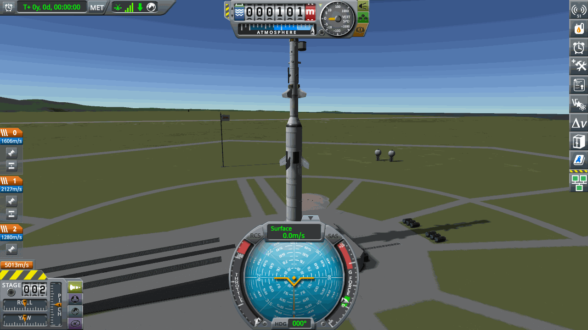
*Jool 1 on the pad. The thin 1.25 m stack on top is the Nerv stage and the probe. The staging display on the left, 1280 / 2127 m/s, matches the plan.*

## 7.20 Ike Station 1: one capture by the numbers, one that didn't fire
The Ike station contract taken in 7.16 (905.6k on completion) flew on the 134 t craft fable designed in 7.17. The contract requires
9 seats, a cupola, ISRU, an antenna, a docking port and power. No kerbals have to be aboard, so it went uncrewed.

- **Launch**: the pad numbers matched `docs/ike-station-plan.md` exactly (1824 / 1277 / 2942 m/s, TWR 1.42). The Twin-Boar's first
  flight, and a quiet ascent. At 79.7×79.9 km the Poodle was full (2942 m/s) and the Skipper had 24 m/s left. The 2 Gigantors, 2 HG-55s
  and the RA-15 deployed at circularization.
- **To Duna**: `transfer Duna --pe 60000 --plan` gave **1085 m/s** (expected 1080–1120), v_inf 829 (planned 868). The arrival inclination
  was 146.6°, retrograde. It tripped the stop rule I had written, but I accepted it, because Duna 1 had once flipped a 124° retrograde
  arrival with 0.4 m/s from far out. The burn carried on past the Skipper → Poodle separation to the end. The burn_time fix from 7.19 worked.
  After the burn the trajectory missed Duna by 61.9 Mm (SOI 47.9 Mm). After leaving Kerbin's SOI, `correct Duna --pe 60000 --inc-to 10
  --plan` 27.1 m/s. The plan was periapsis 59.8 km, inclination 52.9° (not 10°), and the burned result was 279.6 km, 41.7°. About
  1,850 m/s left in the Poodle.
- **Duna capture 586 m/s**: inside the SOI (UT 30.68M), `correct --inc-to 0` for 16.0 m/s (expected about 10) gave periapsis 60.3 km,
  inclination 1.3°. Capture was **586 m/s**. The hand calculation with v_inf 770 had given 586. 1,243 m/s left in a 58×63 km orbit
  (planned about 1,060). Then `transfer Ike --pe 50000 --plan` 310 m/s (planned about 300), Ike v_inf 48, retrograde arrival
  (165°; doesn't matter for the contract), Ike periapsis 47.5 km.
- **The Ike capture didn't fire**: "burn is taking far too long" came up with 135.8 m/s Δv remaining, i.e. the whole burn. Control none,
  signal 0. The uncrewed station lost its CommNet connection near Ike periapsis. Kerbin was hidden behind Ike. The burn guard only checks
  the connection when the burn starts. If it drops during the wait, it goes like Minmus Lab 1 in 7.15: throttle 1, thrust 0, until the timeout.
- **Recovery**: the checkpoint first. The craft was escaping Ike, with 4,381 s until leaving the SOI. With v_inf only 48, 5–15 m/s would
  capture it. Worst case it would stay in Duna orbit with 933 m/s and try again. An ad-hoc script warped 60 s at a time waiting for the
  connection. A minute later, at 82 km altitude, the signal came back, and it burned retrograde until the eccentricity reached 0.6.
  **Ike orbit 33.7×523.5 km.** The contract completed on the spot. **Funds 2.53 → 3.53M.**
- **Fix**: uncrewed burns now recheck the connection right before ignition, and if there's none, wait with short warps. If it drops
  mid-burn, the burn pauses and resumes when the connection returns. Not yet used in flight.

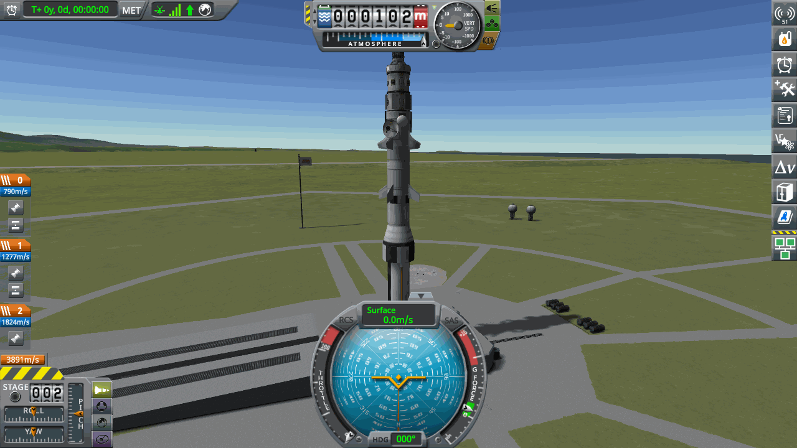
*Ike Station 1 (134 t) on the pad. The staging display on the left, 1824 / 1277 m/s, matches the plan.*

## 7.21 Duna 1 returns: home via a Mun flyby
- **Mid-course correction 7 m/s**: the correction postponed in 7.18. At UT 26,853,909, 90° before arrival, `correct Kerbin --pe 30000 --plan`
  gave **7.0 m/s** (expected about 10), and it was burned as is. Burn error at that distance left the Kerbin periapsis at 204 km
  (inclination 85°). The rest was left for inside Kerbin's SOI.
- **The Mun got in the way**: Kerbin SOI entry UT 29,268,764, periapsis 204 km. `correct` stopped at periapsis 64.7 km (10 m/s). Lower
  paths pass through the Mun's SOI on the way in, before reaching periapsis. The tuner's moon penalty was blocking those paths. It had
  already been changed to ignore a moon met after an in-atmosphere periapsis, but this one was before periapsis, so that didn't apply.
  An ad-hoc grid search showed no Mun-avoiding path below 57 km. Instead, a path **passing the Mun at 2,200 km** gave a final Kerbin
  periapsis of 30 km for 1.2 m/s. Burned, and after the Mun it was 31.0 km.
- **Valentina is home**: reentry, splashdown, recovery. The flight that landed on the Duna Midlands in 7.8 and waited about 600 days is over.
  **Funds 2.35 → 2.53M, science 1,329 → 1,626 (+297)**, "Explore Duna" contract complete.
- **Surface science thrown away**: the "Duna surface science" contract didn't complete. The goo and thermometer data taken on the Duna
  surface were still in the experiment parts on the lander stage, and `reentry` dropped that stage (about 80 points). The Mk1 pod's own
  "Collect All" is blocked (canTransferInVessel = false). So `StoreScience` was added to KspBot. It moves every experiment's data into
  the root part's (the pod's) storage. `collect_science` calls it on crewed craft before dropping stages. A test on Eve 1 moved 7 items,
  with 11 in the pod.

## 7.22 Eve 1 returns: the encounter the game hid
The return plan fable made in 7.14 was right to the meter through departure. The problem came after that: the game screen didn't show
a Kerbin encounter.

- **Departure**: `depart Kerbin --pe 30000 --plan` gave a plane tilt at the apoapsis of 104.6 m/s (expected 105) and a trial escape
  calculation of 215 (planned 215). Burned the tilt, then a second `depart ... --at 29029189` burned 214.8 m/s and escaped. Left Eve's SOI
  at UT 29,087,752, solar apoapsis 15.96 Gm.
- **No encounter**: `correct Kerbin` couldn't find an encounter (coarse search 48 m/s, "no encounter"). The trajectory passes Kerbin at
  39 Mm around UT 35,464,577. Kerbin's SOI radius is 84 Mm. Even a test node that cut the closest approach to 0.26 Mm didn't produce a
  Kerbin orbit patch.
- **Diagnosis (fable)**: read the decompiled `PatchedConics._CheckEncounter` and `Orbit._SolveClosestApproach`, and reproduced the same
  calculation with our `kspbot/kepler.py`. KSP's encounter calculator starts searching at the first of the two points where the orbits
  cross (+23 days, distance 308 Mm). The second candidate time is folded into the range (−P/2, P/2] for orbital period P, and the gap
  between the two times (4,303,298 s) was 10 hours longer than P/2. So the second candidate landed in the past, and the real pass (+73 days)
  was never checked. One more important fact: **SOI transitions don't depend on this prediction.** `OrbitDriver.
  CheckDominantBody` decides from the actual position (in rails warp and at 1× alike). The craft enters Kerbin's SOI even though the screen
  doesn't show it. And the prediction was that once UT passed about 31.2M and the first crossing point was in the past, the game would show
  the encounter too.
- **It showed up as predicted**: after UT 31.2M the game showed a Kerbin encounter (periapsis about 39 Mm). `correct` planned a 28.5 km
  periapsis for 3.6 m/s, but burn error made it 1,809 km. At UT 34.5M another 3.2 m/s gave **periapsis 30.3 km** (no Mun on the way in).
- **Return**: reentered at an arrival v_inf of 2,126 (`collect_science`: 0 newly moved, 11 in the pod). The drogue opened at 20 km at
  771 m/s, and it came down in the Grasslands. **Jeb recovered, science 3,594 → 4,214 (+620), funds 3.61 → 3.64M.** Short of the about
  1017 points calculated as riding in the pod in 7.11.
- **Lesson**: no encounter on the game screen doesn't mean no encounter. The game's predictor can have bugs too, and this time our own
  independent orbit calculation (`kepler.py`) caught it. Waiting was the answer, not burning to fix it.

## 7.23 The lab is a science engine (Minmus Lab 1 visits)
7.15 said "visit and empty it at least every 50 days." During this period the lab was visited seven times. One of them was far too late,
and three transmissions failed silently.

- **120 days from bad arithmetic**: from UT 23.456M at about 9.3 points per day, the 500-point cap fills around 24.62M. But the note said
  about 27.5M. The lab sat full for about 120 days and threw away about 1,000 points' worth of output.
- **Transmissions that fail silently**: on that late visit, the first `lab transmit` did nothing. Electric charge was 1,793 EC (about 2,000
  needed), and there was no error. Charging the batteries and trying again took science **330 → 829**. After that, transmissions at UT
  31.88M and 34.1M also sent nothing (EC 2,056, 2,102). The failure threshold is between 2,102 and 2,425 EC. At 34.1M it warped in
  sunlight to fill up to 3,176 EC and sent again. Now `lab transmit` refuses under 3,000 EC, waits until the science actually arrives, and
  exits with code 1 if it doesn't.
- **The other visits**: UT 28.40M +485 (→ 1,314), 29.55M +492 (1,626 → 2,118), 30.75M +498 (→ 2,620), 33.0M +495 (→ 3,114),
  34.1M retry (→ 3,590). Each time it was refilled with data from the storage box (730–736/750), and that backlog of data is now almost used up.
- **KSP was off**: after the lab script, the kRPC connection timed out. KSP had shut down. Restarted at UT 34,100,165; the last save was at
  the Space Center, so nothing was lost. Windows had 25.7 GB committed, nonpaged pool 1.52 GB (0.89 at the start of the session).
  Still climbing.
- **How much it earned**: from the first visit in 7.17 through 34.1M, eight successful transmissions, about 3,700 points total. The biggest
  landing/science flights were Survey 1 at 1,601 points and Minmus Science 2 at 1,166. A station launched once yields about 500 points per visit.
  Science passing 4,000 even after spending 550 on Jool research is mostly thanks to this.
- **Now**: UT about 35.47M, funds 3.64M, science 4,214, reputation about 521. Everyone is home except Bob and Gwenbro on Minmus Lab 1.
  Jool 1 enters Jool's SOI at UT 52,787,080, and Ike Station 1 is in Ike orbit (about 920 m/s). While picking the next destination,
  `window` failed to find the Moho window because it sat 2.5 days past the one-synodic-period search range, so the range was widened to 1.5
  periods.

## 7.24 Progress cards v2
The user asked for new shareable images to post on the blog and X. The first set (`docs/media/summary/01~05`) was made on the first
evening, at 20 launches, and was out of date. fable planned and reviewed it (`docs/summary-cards-plan.md`), and opus made it
(`tools/summary/v2/`, output is the 10 images in `docs/media/summary/v2/`). Scoreboard, places visited so far, how it works, two launch
lists, crafts, science, crew, failures, time. Two rules. Every number is read only from `docs/record/career.json`, and a missing number
first goes into career.json with a LOG line number as its source. No touching the game while making cards. Craft photos were taken in the
sandbox save kept only for photos, and only 6 of 8 crafts got photographed (the Minmus Science 2 and Survey 1 launches timed out). From
now on career.json is updated and the cards rebuilt after every mission.

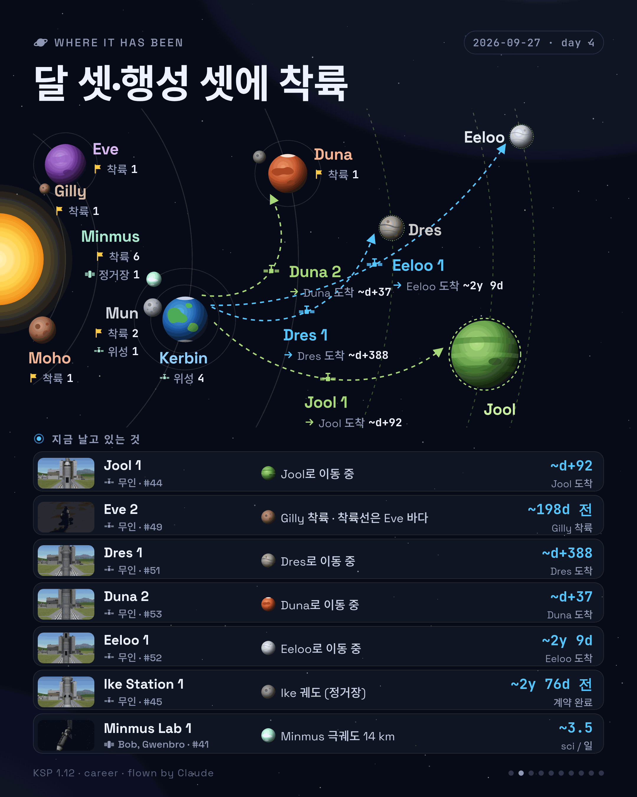
*Card 02 "Landed on two moons and one planet". Currently flying: Jool 1, Ike Station 1, Minmus Lab 1.*

## 7.25 Moho 1 (#46): a probe that flew level at 38 km and burned up
Moho is the planet closest to the sun. Its orbit is inclined and eccentric, so both getting there and getting captured take a lot of Δv.
fable did the design (`crafts/moho-1.json`, `docs/moho-1-plan.md`). An uncrewed lander flown by an OKTO.

- **Design**: no nuclear engine this time. The arrival hyperbola at Moho has an eccentricity of about 21, so the Oberth window for burning
  at periapsis is a little over 2 minutes. A low-thrust Nerv would miss that window and waste about 500 m/s. So it's chemical engines all
  the way. Twin-Boar / Skipper / Poodle / Terrier lander, 138.08 t, 80k. The budget from low orbit is about 5,200 m/s (escape about 2,040,
  mid-course correction 200–400, capture about 2,690 into 25×1,000 km) plus landing about 1,200 and about 600 margin. The pad numbers
  matched the plan (1430 / 1198 / 3513 / 4218 m/s).
- **Lost at 3 min 58 s (launch #46, UT 38,425,025)**: the Twin-Boar separated at 15.5 km, 638 m/s, pitch 38°. The Skipper that took over
  had a TWR of only 0.85 but kept following the altitude-based pitch program (12° at 34 km). The apoapsis only crept up from 24 km to 38 km.
  The craft flew level at 38 km at 2 km/s. The OKTO on top reached 1206/1200 K and exploded (the OX-STAT-XL solar panels were at 1452 K).
  revert to launch, recover, full refund.
- **The cause was ascent guidance**: stage 1 had no time-to-apoapsis (t_apo) guard. Earlier launchers staged higher up, so it just never
  showed. Fixed so that above 12 km, inside the atmosphere, if t_apo is under 45 s the pitch is raised by 1.5 × (45 − t_apo) (the 15° AoA
  limit stays).
- **Two mistakes of mine**: `ascent` ended with exit code 2, but the chain was joined with `;`, so `circularize` ran anyway. Flight phases
  are always joined with `&&`. And the user saw the explosion on screen first. I was only waiting for the background task's completion notice.
  During an ascent, read the output file every 1–2 minutes.

## 7.26 Moho 1 (#47): an escape that looked perfect, an encounter that vanished
Relaunched right after a PC restart (UT 38,426,090). About 24,000 s were left until the window (UT 38,450,305).

- **The t_apo guard did its job**: pitch 27.7° at MET 120 s (18.4° on #46), apoapsis 46.8 km at 3:00 (stop rule was 45). The Skipper
  dropped at 3:18, 45 km. Then the TWR 0.7 Poodle held t_apo at about 45 s, flying almost level (pitch 1–6°) at 45–51 km for about 2
  minutes. The OKTO skin temperature peaked at **about 880 K out of 1200 K** and cooled during the coast. 79.3×79.6 km,
  **Poodle 2,961 m/s** (planned 2,950–3,050). The guard works, but it keeps a low-TWR stage in the upper atmosphere for a long time. Fine for
  this craft. From now on, watch the skin temperature.
- **The plan was good**: `transfer Moho --pe 25000 --plan` refined the flight time from 113.3 to 114.9 days, and at arrival Moho was
  **on our orbital plane**. The planned 200–400 m/s mid-course plane change was no longer needed at all. Node 2,040 m/s (planned
  2,030–2,060), arrival v_inf 3,652, retrograde pass (inclination 142°).
- **No encounter**: burned. 881 m/s left in the Poodle, solar periapsis/apoapsis off from the plan by 150 / 2,300 km. The command said
  "residual 0.2 m/s". But there was no Moho encounter. Closest approach 331,674 km; at arrival the craft is about **420,000 km behind** Moho
  along the orbit.
- **The cause was burn timing (recorder)**: `burn_time` split the stage's burn time in proportion to Δv (2040/2961 × 253 = 174 s).
  The actual burn was 196–204 s. As the craft gets lighter, half the Δv is reached not at 87 s (bt/2) after ignition but at about 113 s.
  The center of the burn was about **26 s late**, meaning it burned at a spot about 5° further along the 80 km orbit. `burn_time` now
  computes from the propellant mass ratio, and `burn_lead` (time to reach half the Δv) is used in execute_node, manual_burn and the capture's
  comms wait. Same function as Jool 1 stopping 601 m/s short in 7.19, a different bug.
- **Judgment mistake**: "residual 0.2 m/s" was read as success, and the encounter was only checked after warping out of Kerbin's SOI. Inside
  the SOI it would have been a few m/s to fix. The lesson from 7.9, "the command finished is not it went well," learned again. After an escape
  burn, read the target encounter before leaving the SOI.
- **Tuner 390, Lambert 77**: far out, `correct Moho --pe 25000 --inc-to 0 --plan` gave **390 m/s** (v_inf 3,174, inclination 98°). Not
  burned. The tuner's cost function has no Δv term, the hole already seen in 7.19. Instead an ad-hoc Lambert was solved (projected onto
  our orbital plane, like the transfer planner). In-plane, 76 m/s now (90 at +10 days, 107 at +20 days), plus about 7 m/s of plane change
  later. At arrival the plane was only −92 km off. Built a node from the Lambert vector (almost purely radial-in, 76.95 m/s), and a
  prograde/normal ±0.12 m/s grid picked a periapsis of 25–40 km on the prograde side (here the normal component barely moves the pass, so
  the only options were 56° or 137° inclination). **Burned result: Moho periapsis 1,056 km, inclination 54° (prograde), Poodle 805.**

## 7.27 Moho 1: a wobbling autopilot, blocked comms, a late capture, and a landing
- **The correction was oddly expensive**: trimming 10 days before the SOI (UT 40.71M). My ad-hoc ±1 m/s grid found nothing. Here 1 m/s only
  moves the pass point about 200 km. A local search with a Δv term found periapsis 24.8 km, inclination 61° for 4.55 m/s. Burning it with
  `ksp node` (tolerance 0.2) gave **periapsis 59.9 km**. 0.2 m/s is about 35 km.
- **Botched it burning from a one-line Python script**: to burn another 0.16 m/s, 1 % thrust was set from ad-hoc Python instead of the CLI.
  The craft swung at over 11°/s, the rotation guard toggled the engine off and on for 400 s, and the `timeout 400` I had set killed the process
  with the throttle at 0.68. Moho periapsis −87 km, about 10 m/s wasted. Burns only go through the CLI, where the recorder is attached.
- **Two reasons the autopilot wobbled**: (1) kRPC autopilot's `time_to_peak` was at its default (1,1,1) (only ascent had been changed to 5).
  The floppy stack swung ±20° even with SAS on. At 8 s, a 110° turn settled within 0.5° in 30 s. (2) execute_node aimed in the node's reference
  frame, which rotates along with the changing orbit. So in the last 5 m/s of every burn the rotation rate rose by about 1°/s every second.
  Fixed with `ksp node --tol --thrust` (restores the thrust limit and sets throttle 0 in finally), time_to_peak 8 s during burns, and steering
  in the body's inertial frame. Burned 1.0 m/s again at 5 % thrust: **Moho periapsis 23.9 km, inclination 69.8° (prograde)**.
- **Comms drop in the middle of the capture**: at the Moho SOI (UT 40,929,000), periapsis 23.9 km, 44 minutes to periapsis, signal 0.92.
  Using positions from the orbit patches, it computed whether the straight line to Kerbin crosses Moho's disk. **Blocked from 10 s before
  periapsis to 130 s after.** That's the back half of the capture burn. The same situation as the Ike capture that didn't fire in 7.20.
  Burning early wasn't the answer (a retrograde burn before periapsis drags the periapsis underground, +300 m/s).
  **35 minutes before periapsis, 70 m/s raised the periapsis to 175 km.** Now the line clears Moho by at least 41 km.
- **The capture started late**: `capture --apo 1000000` said "about 131 s, start 80 s early". The craft had come in from the Space Center via
  `fly`, so KSP hadn't calculated per-stage Δv ("Delta-v has not been calculated"), and `burn_time` computed with the Poodle alone. The real
  burn is 278 s (Poodle 694 + Terrier 2,293, 144 s to half the Δv). The command was stopped to rerun with `--early`, but it had already warped
  to the start point. **117 s to periapsis.** Burned by hand on the spot (autopilot retrograde, full throttle, auto staging, stop below a
  1,000 km apoapsis). **Capture 38.7×999.6 km**, Terrier **1,843 m/s** (planned about 2,100). The late start ate periapsis (175 → 39 km) and
  about 150 m/s of Oberth, plus the 70 m/s for raising the periapsis.
- **Science and circularization**: high-orbit science **+556**. Circularized at periapsis for 210 m/s, **38.0×38.3 km** (no rotation; the
  steering fix worked). Low-orbit science **+537**. Terrier 1,631.
- **Land where Kerbin is visible**: the far half of the 38 km orbit has no comms. The landing site search got one more condition besides
  biome and slope: Kerbin elevation at least 20° at touchdown, at least 10° 150 s before touchdown. It came up with Midlands 56.9, −168.0.
  `land --at` picked a pass one orbit earlier (1.4 km difference, elevation 54–62°). **Moho landing, 55.50, −169.24
  (UT about 40.953M)**. Upright, 27/27 parts, Terrier **296 m/s left** (about 1,335 for landing). Surface science **+423 → science
  6,432**. Funds 3.10 → 3.40M (Moho firsts). **Moho 1: science about 1,516, funds about 300k.**
- **The lab in the meantime**: three visits to Minmus Lab 1 during the cruise. At UT 38.48M research was eating power (2,802 → 1,150 EC in
  an hour), so `lab stop`, 30 minutes of charging (3,810), **+420**, `lab start`. 39.50M **+444**, 40.45M **+412** (first transmission failed
  for lack of connection, retry succeeded).
- **Homework left**: KSP per-stage Δv being empty after `fly` (a multi-stage fallback in burn_time or a forced recalculation), the
  comms-aware landing site search into `land` (for now an ad-hoc site.py), and a comms forecast for captures in code.

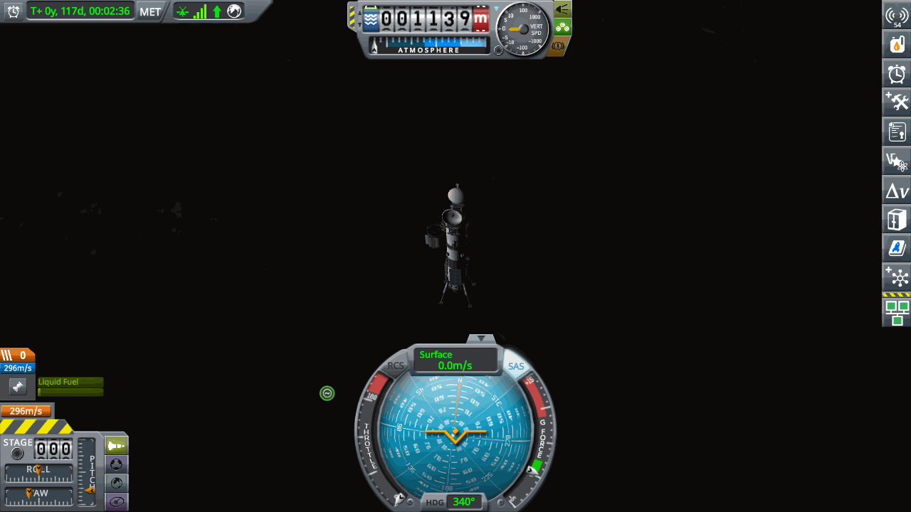
*Moho 1 on Moho's night side. MET 117 days, altimeter 1,139 m, 296 m/s Δv left. The signal bars are full because the site was picked where Kerbin hangs in the sky.*

## 7.28 Eve 2 (#48, #49): a rocket that flipped near the speed of sound, four tail fins
Eve 2 carries two craft on one launch. Below is the carrier for the Eve equatorial satellite contract (302k), above is an uncrewed Eve
lander with an inflatable heat shield. Before this, opus added `KspBot.RecalcDeltaV()` to the mod, to fix the "no per-stage Δv" problem that
made the capture late in 7.27, even right after `fly`.

- **#48 (UT 41,150,016)**: at MET 55 s, 8 km, about 335 m/s, 24 kPa dynamic pressure, the nose came up against the commands. AoA went
  −1° → −15° → −39° in 6 s. The cause was the blunt 2.5 m diameter heat shield drum at the very front. Exactly the problem the plan had even
  named as an ascent risk. revert to launch, recover, full refund. 4 Tail Fins went on the S3-3600 tank, offset 45° from the AV-R8s
  (+0.5 t, 137.05 t, 76 parts).
- **#49**: AoA 1.4° or less and rotation 2°/s or less through the transonic range. At 79.3×79.5 km the Poodle's 3,321 m/s was untouched
  (Skipper 99 left, planned 150–250: the fins' weight and drag).
- **Escape and correction**: node 1,026 m/s, 190-day flight, arrival v_inf 1,103 (planned 850–950). This time the Eve encounter was read
  *before* leaving Kerbin's SOI (the lesson from 7.26). Outside the SOI, Eve periapsis 29,486 km. A long-range correction of 7.71 m/s predicted
  "periapsis 120 km" but the actual was **10,358 km, inclination 2.8°**. 185 days out, the encounter KSP computes from the node trajectory
  and the encounter of the actual orbit after the burn differ by thousands of km. Fine corrections from far out are meaningless. The real
  correction happens about 20 days before the SOI.

## 7.29 Mun Sat 1 (#50): the orbit was matched, but there was no contract
A contract to put a satellite into a specific Mun orbit (inclination 146.04°, eccentricity 0.181, semi-major axis 803 km, 3 % tolerance).
The craft is Keo Relay 3 plus goo, a magnetometer and an accelerometer.

- **The capture comms forecast worked on its first flight**: opus put the "is Kerbin blocked during the capture" calculation, done by hand in
  7.27, into `capture`. First real use at the Mun. It forecast Kerbin being blocked from 183 s before periapsis, and moved the burn 216 s
  earlier. 225 m/s into 429×778 km. Done in one go.
- **Matching the orbit**: `match-orbit` plane 34.6°, two trims. The argument of periapsis was 17.8° off, so the major axis was rotated by
  hand with a 16 m/s radial burn at the orbit intersection. The periapsis-side intersection had no comms and `node` refused it, so the
  apoapsis side was used. Periapsis trim 1 m/s. Every element came within KSP's tolerance (checked against the decompiled
  `VesselUtilities.VesselAtOrbit`).
- **But the contract didn't complete**: kRPC showed both Mun contracts as active and the advance (70.9k) had been paid. But the save still
  had both as 'offered'. After coming back to the Space Center from a lab-visit flight, the ContractSystem had been left in a stale state (the
  offered list had changed entirely too). Restarting KSP cleared it. But taking the contracts again now runs into two things: a craft launched
  before the contract doesn't count, and the advance gets paid a second time. Both contracts were skipped, and the 70.9k advance was logged in
  LOG as unexpected income. Mun Sat 1 stays as a Mun relay (RA-2, 4,264 m/s).
- **What was fixed**: after accepting a contract, `accept` compares the save's count of active contracts with kRPC's and errors if they
  differ. The check after the next scene change was 6 = 6.

## 7.30 Dres 1 (#51): somewhere nobody has been
Dres is a small dwarf planet between Duna and Jool. fable did the design (`crafts/dres-1.json`, `docs/dres-1-plan.md`).
The lander that set down upright on Moho 1 went on top of Duna 1's launcher. OKTO, uncrewed, one way, all science transmitted. Dres is far
from the sun, so it carries an RA-100 dish and an RTG. The pad numbers matched the plan exactly (1177 / 1045 / 2742 / 3683 m/s).

- **Launch (UT 43,090,014)**: apoapsis 47 km at 3:00, AoA 3.0° or less at staging. 79.4×79.6 km, **Poodle 1,759 m/s**
  (planned 1,500–1,650).
- **Escape**: `transfer Dres --pe 40000 --plan` gave 1,590 m/s (planned 1,600–1,620), a 744-day flight, arrival v_inf 1,490.
  At arrival Dres is 1,332 Mm off our orbital plane, as planned. The mid-course correction of about 116 m/s happens at UT 56,159,878.
  Burned on the Poodle alone (160 left). Solar orbit 13.34×42.70 Gm (planned 42.74). Dres arrival around UT 59.19M.
- **The lab in the meantime**: UT 42.35M **+400**, 43.37M **+441**. Research: propulsionSystems (Spark/Ant), then unmannedTech,
  composites, advMetalworks, ionPropulsion. 4,572 science left.

## 8. Candidates for standalone mods
Pieces of the current KspBot mod that could be split out and released as standalone mods:
1. **JSON → craft builder** (`CraftBuilder.cs`): builds a craft from a text spec. Supports stack nodes, surface attach, symmetry,
   staging, rigid/autostrut. Useful for designing craft from an LLM or a script.
2. **kRPC career extension service** (`Service.cs`): tech research, facility upgrades, hiring, a KSP flight event log stream.
   Career APIs that kRPC doesn't have.
3. **Save autoload** (`AutoLoad.cs`): for headless or automated runs.
4. (Python) **Flight recorder**: combines KSP's flight log and telemetry and raises alerts on anomalies.
5. Popup dismissal (`DismissDialogs`) and the flight event log (`FlightEvents`) aren't features only this project needs.
   They're small utilities anyone automating KSP through kRPC could use.

What may be needed later: EVA control (not in kRPC: go on EVA, plant a flag, take samples, board), placing strut parts (a builder extension).
